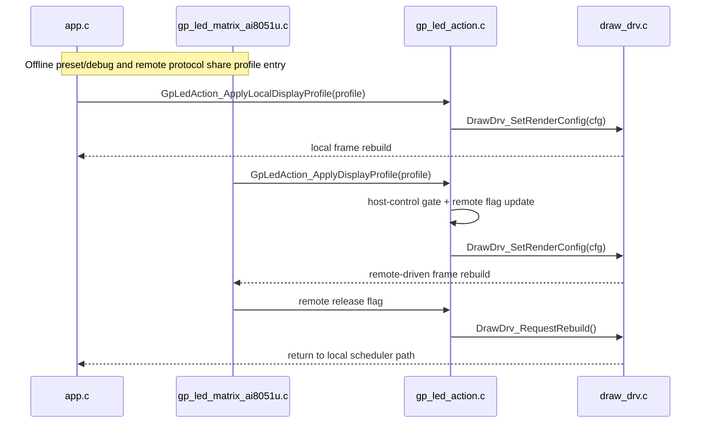

# LED Display Profile Structure

## Purpose

This document describes the unified `LED-side` display-profile data structure used to control:

1. content selection (`solid` / `pattern` / `glyph`)
2. color strategy (primary/secondary, gradient toggle)
3. animation effect and stepping

The structure definition is in:

- `Project/STC51/ws2812_driver/Sources/inc/gp_led_display_profile.h`

The single control entry that applies this structure is:

- `Project/STC51/ws2812_driver/Sources/mid/gp_led_action.c`
- `GpLedAction_ApplyDisplayProfile(...)`
- `GpLedAction_ApplyLocalDisplayProfile(...)`

## Why this structure

Before this change, action-driven animation/display parameters were set directly in `GpLedAction_ApplyAction(...)`.
Now the flow is:

1. protocol payload -> profile mapping
2. profile validation
3. one apply function updates render config and display mode

This reduces duplicated mode/color/effect handling paths and keeps local/remote behavior aligned.

## Data fields

`GpLedDisplayProfile` fields are grouped by responsibility:

1. Routing and mode
   - `source`
   - `content`
   - `actionFlags`
2. Animation and orientation
   - `effect`
   - `direction`
   - `scrollStep`
   - `animStep`
   - `frameIntervalMs`
   - `animationFlags`
3. Color and brightness
   - `colorMode`
   - `brightness`
   - `primaryR/G/B`
   - `secondaryR/G/B`
   - `gradientSpan`
4. Content IDs
   - `patternId`
   - `glyphId`
   - `applyFlags`
5. Timeline extension (LVGL-style lightweight reservation)
   - `timelineDurationMs`
   - `timelineRepeatDelayMs`
   - `timelineRepeatCount`
   - `timelinePath`

## Mapping from protocol payload

Current mapping source:

- `GpMatrixActionPayload` from `Project/Protocols/gp_led_matrix_protocol.h`

Applied in:

- `GpLedAction_LoadProfileFromAction(...)`

Key mappings:

1. `primary_r/g/b` -> `primaryR/G/B`
2. `secondary_r/g/b` -> `secondaryR/G/B`
3. `effect` / `direction` / `color_mode` -> same semantic fields
4. `pattern_id` / `glyph_id` -> `patternId` / `glyphId`
5. `scroll_step` / `anim_step` / `gradient_span` -> same semantic fields
6. `flags` -> `actionFlags`

## Single-control behavior

`GpLedAction_ApplyDisplayProfile(...)` performs:

1. host-control gate check
2. remote-release shortcut
3. profile validity check
4. render-config conversion
5. content-specific apply
   - `solid`: update config only
   - `pattern`: update config + optional image index apply
   - `glyph`: update config + optional glyph index apply
6. mark remote active and trigger rebuild

`GpLedAction_ApplyLocalDisplayProfile(...)` reuses the same core apply logic for offline presets/debug paths,
but keeps host-control priority and does not mark remote-active state.

## LVGL-inspired design notes

This implementation borrows lightweight ideas from LVGL animation architecture without adding LVGL dependency:

1. Descriptor-first control
   - similar to `lv_anim_t` descriptor usage
   - parameters are collected first, then applied once
2. Callback-like separation
   - mapping and validation are separated from final apply logic
3. Timeline readiness
   - reserved interval/animation fields allow future multi-stage timeline scheduling

## Runtime context optimization

`draw_drv.c` now keeps animation runtime state in one context object instead of scattered globals.

Runtime context focus:

1. animation phase
2. scroll offset
3. timeline elapsed time
4. timeline repeat/delay state

This keeps animation state transitions localized and reduces drift between effect update paths.

## Minimal timeline executor (breath first)

Current minimal executor scope:

1. If `effect = breath` and `timelineDurationMs > 0`, use timeline stepping.
2. Map elapsed time to phase range `0..31`.
3. Apply optional timeline path (`linear`, `ease_in_out`, `breath_curve`).
4. Respect repeat count and repeat delay.

If timeline is not enabled, existing `animStep` behavior is preserved.

Current unified timeline coverage:

1. `breath`
2. `fade_in`
3. `fade_out`

## Local key pattern switching

Offline key short-press pattern switching is restored and expanded:

1. Local key short press on `P32` now cycles pattern index directly in offline mode.
2. If current content is not `pattern`, path switches to `pattern` before applying next image.
3. Offline local pattern code is now extracted to a dedicated module:
   - `Project/STC51/ws2812_driver/Sources/inc/offline_pattern.h`
   - `Project/STC51/ws2812_driver/Sources/mid/offline_pattern.c`
4. Extra local procedural patterns are added in the offline-pattern module:
   - checker
   - border
   - diagonal X
5. `P32` local switching is blocked only when remote display content is actively driving the panel.
   Plain transport keepalive or communication-online state alone must not suppress local pattern switching.

This keeps key behavior intuitive while preserving the unified profile-apply path.

## Local/remote priority sequence

## Extension rules

1. Add new display behavior by extending `GpLedDisplayProfile` first.
2. Keep protocol mapping centralized in `GpLedAction_LoadProfileFromAction(...)`.
3. Keep side effects centralized in `GpLedAction_ApplyDisplayProfile(...)`.
4. Do not add parallel direct-write animation paths in unrelated modules.
