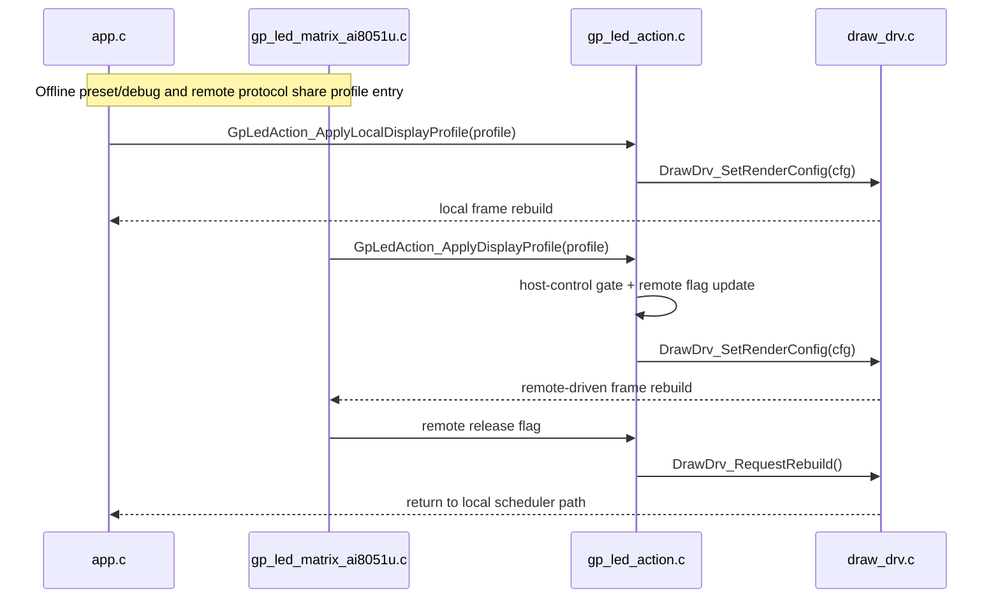

# LED Display Profile Structure

## Purpose

This document describes the unified `LED-side` display-profile data structure used to control:

1. content selection (`solid` / `pattern` / `glyph`)
2. color strategy (primary/secondary, gradient toggle)
3. animation effect and stepping

The structure definition is in:

- `Project/STC51/ws2812_driver/Sources/inc/gp_led_display_profile.h`

The single control entry that applies this structure is:

- `Project/STC51/ws2812_driver/Sources/mid/gp_led_action.c`
- `GpLedAction_ApplyDisplayProfile(...)`
- `GpLedAction_ApplyLocalDisplayProfile(...)`

## Why this structure

Before this change, action-driven animation/display parameters were set directly in `GpLedAction_ApplyAction(...)`.
Now the flow is:

1. protocol payload -> profile mapping
2. profile validation
3. one apply function updates render config and display mode

This reduces duplicated mode/color/effect handling paths and keeps local/remote behavior aligned.

## Data fields

`GpLedDisplayProfile` fields are grouped by responsibility:

1. Routing and mode
   - `source`
   - `content`
   - `actionFlags`
2. Animation and orientation
   - `effect`
   - `direction`
   - `scrollStep`
   - `animStep`
   - `frameIntervalMs`
     - local draw cadence in milliseconds; `0` falls back to the current local default `32 ms`
   - `animationFlags`
3. Color and brightness
   - `colorMode`
   - `brightness`
   - `primaryR/G/B`
   - `secondaryR/G/B`
   - `gradientSpan`
4. Content IDs
   - `patternId`
   - `glyphId`
   - `applyFlags`
5. Timeline extension (LVGL-style lightweight reservation)
   - `timelineDurationMs`
   - `timelineRepeatDelayMs`
   - `timelineRepeatCount`
   - `timelinePath`

## Mapping from protocol payload

Current mapping source:

- `GpMatrixActionPayload` from `Project/Protocols/gp_led_matrix_protocol.h`

Applied in:

- `GpLedAction_LoadProfileFromAction(...)`

Key mappings:

1. `primary_r/g/b` -> `primaryR/G/B`
2. `secondary_r/g/b` -> `secondaryR/G/B`
3. `effect` / `direction` / `color_mode` -> same semantic fields
4. `pattern_id` / `glyph_id` -> `patternId` / `glyphId`
5. `scroll_step` / `anim_step` / `gradient_span` -> same semantic fields
6. `flags` -> `actionFlags`
7. `frameIntervalMs` is not yet carried by `GpMatrixActionPayload`; action mapping currently falls back to the local
   default `32 ms` until a protocol extension is added

## Single-control behavior

`GpLedAction_ApplyDisplayProfile(...)` performs:

1. host-control gate check
2. remote-release shortcut
3. profile validity check
4. render-config conversion
   - `frameIntervalMs` is forwarded into `DrawDrv_RenderConfig`
5. content-specific apply
   - `solid`: update config only
   - `pattern`: update config + optional image index apply
   - `glyph`: update config + optional glyph index apply
6. mark remote active and trigger rebuild

The cooperative draw scheduler is still owned by `app.c`, which reads the active render config and retunes the local
draw task to match `frameIntervalMs`.

The active effect/render parameters now have one owning storage object inside `draw_drv.c`.
`app.c` and `gp_led_action.c` retune and update the live configuration through that shared render-config store instead
of maintaining extra task-sync/action-side copies for the currently active effect parameters.

`GpLedAction_ApplyLocalDisplayProfile(...)` reuses the same core apply logic for offline presets/debug paths,
but keeps host-control priority and does not mark remote-active state.

## LVGL-inspired design notes

This implementation borrows lightweight ideas from LVGL animation architecture without adding LVGL dependency:

1. Descriptor-first control
   - similar to `lv_anim_t` descriptor usage
   - parameters are collected first, then applied once
2. Callback-like separation
   - mapping and validation are separated from final apply logic
3. Timeline readiness
   - reserved interval/animation fields allow future multi-stage timeline scheduling

## Runtime context optimization

`draw_drv.c` now keeps animation runtime state in one context object instead of scattered globals.

Runtime context focus:

1. animation phase
2. scroll offset
3. timeline elapsed time
4. timeline repeat/delay state

This keeps animation state transitions localized and reduces drift between effect update paths.

`frameIntervalMs` now controls the time delta applied to local timeline progression, while `scrollStep` and `animStep`
continue to describe how much progress happens per step.

## Compact bitmap storage rule

The current LED-side storage rule is now intentionally split into two layers:

1. External compatibility layer
   - LED side still accepts compact `BITMAP_RGB888` frames and layered frames from the protocol boundary.
2. Internal canonical storage layer
   - offline local patterns are stored as single-layer `BITMAP_LAYERED` resources
   - buffered animation playback stores exactly `32` frames of `36 bytes`
   - canonical frame shape: `1 byte seq_total + 32 byte bitmap + 3 byte RGB888`

This means the LED-side playback buffer is no longer a variable-size layered store.
Instead, upload-time logic normalizes these common inputs into the canonical single-layer frame:

1. one-layer `BITMAP_LAYERED`
2. `BITMAP_RGB888`
3. two-layer `BITMAP_LAYERED` when layer 0 is a full-frame black background and layer 1 is the foreground bitmap

If a layered input cannot be losslessly compressed into that black-base single-layer form, it stays on the direct
render path and is not stored in the compact loop buffer.

## Minimal timeline executor (breath first)

Current minimal executor scope:

1. If `effect = breath` and `timelineDurationMs > 0`, use timeline stepping.
2. Map elapsed time to phase range `0..31`.
3. Apply optional timeline path (`linear`, `ease_in_out`, `breath_curve`).
4. Respect repeat count and repeat delay.

If timeline is not enabled, existing `animStep` behavior is preserved.

Current unified timeline coverage:

1. `breath`
2. `fade_in`
3. `fade_out`

## Local startup scheme and key behavior

The current offline startup and key-driven presentation flow is centralized in:

- `Project/STC51/ws2812_driver/Sources/mid/local_display_scheme.c`

Current behavior:

1. Boot starts with a `2 s` local carousel over the offline preset patterns; later animated startup entries switch on their own effect-complete boundary instead of a fixed `2 s` cut.
2. Each carousel step uses a different solid-color theme.
3. The last carousel frame is a blue `JLU` emblem.
4. After the carousel, the local scheme keeps the `JLU` emblem selected and rotates through the current local effect set, then runs a local synchronized clock effect slice.
5. The startup path now ends in a persistent three-zone clock display driven by AI-side time sync: line 1 shows year, line 2 shows month/day with a steady dot separator, line 3 shows hour/minute with a once-per-second blinking colon, row 15 is a 4-second step progress row, and column 15 carries a vertical edge animation.
6. Offline key mapping is now:
   - `P32` short press: next pattern, including the extra “last AI bitmap” local preset slot once a host bitmap has been received
   - `P32` long press: toggle text scroll and synchronized clock
   - `P33` short press: next effect
   - `P33` long press: next color theme
7. Manual key actions now always reclaim the local draw path.
   - If the selected image is the extra “last AI bitmap” preset slot, LED side immediately requests the ESP32 side to replay the latest cached bitmap.
   - When the replayed bitmap arrives while that preset slot is active, LED side refreshes the cached local pattern instead of stealing control back into direct-frame remote mode.
8. Local default themes now keep the background black for all preset/effect combinations, including gradient-style
   foreground effects.
9. `row reveal` and `row hide` now reserve both endpoint frames explicitly.
   - `row reveal` starts from one full-dark frame, then reveals rows one by one, and keeps one fully lit frame at the end.
   - `row hide` starts from one fully lit frame, then hides rows one by one, and keeps one full-dark frame at the end.

The local startup playlist is now stored in one compact table instead of parallel arrays:

1. Local images are numbered first.
   - pattern images reuse `OFFLINE_PATTERN_IDX_*`
   - one extra local image id is reserved for the latest AI-side bitmap snapshot
   - text-only, text-with-emblem, and clock pages use dedicated local image ids after that extra snapshot slot
2. Each autoplay entry stores:
   - `imageId`
   - `colorIndex`
   - `effectCmd`
3. `effectCmd` is now an explicit local effect descriptor inside `local_display_scheme.c`, not a packed integer.
   - `effectId`
   - `scrollStep`
   - `animStep`
   - `frameIntervalMs`
   - `gradientSpan`
   - `flags`
   - `timelineId`

This replaces the previous split storage of:

1. pattern carousel ids
2. pattern color ids
3. auto-effect ids
4. fixed text-sequence arrays used only by the startup flow

The result is that startup playback selection now follows a single `image number + effect command` contract, and the
same effect descriptor format is reused by local autoplay items and the manual local effect table.

This keeps the startup demo flow and the manual offline controls in one place instead of scattering state across
`app.c` and `key_ctrl.c`.

## Current effect surface and parameter generality

The current local effect surface is reasonably reusable because pattern and glyph routes already share the same
`DrawDrv_RenderConfig` time base and color controls.

Reusable controls today:

1. `contentType`
   - switches between `solid`, `pattern`, `glyph`, and the local-only `clock` route backed by `rtc_clock.c`
2. `effect`
   - selects `static`, `breath`, `gradient`, `scroll_left`, `scroll_right`, `text_scroll_jlu`, `fade_in`,
     `fade_out`, `color_cycle`, `row_reveal`, `row_hide`, or `gradient_reveal`
3. `primary / secondary color`, `colorMode`, `gradientSpan`, `brightness`
   - apply to pattern and glyph rendering; clock rendering now starts from its own fixed per-zone RGB332 palette and still participates in brightness / effect modulation
4. `frameIntervalMs`
   - sets the local time base
5. `scrollStep` and `animStep`
   - keep the per-step spatial and phase increments separate from the time base
6. `timelineDurationMs`, `timelineRepeatDelayMs`, `timelineRepeatCount`, `timelinePath`
   - currently used by `breath`, `fade_in`, and `fade_out`

Current generality limits:

1. Scrolling subtitle content is customizable by glyph sequence through `DrawDrv_SetTextScrollSequence(...)`, so it is
   not locked to a single fixed word order anymore.
2. The new `row_reveal`, `row_hide`, and `gradient_reveal` effects are currently LED-side local effects only.
   - `gp_led_action.c` and `Project/Protocols/gp_led_matrix_protocol.h` still stop at `color_cycle`
   - promote them to protocol-visible enums only if the AI side must trigger the same behavior
3. However, the scrolling subtitle path still consumes glyph indices, not arbitrary `16x16` local pattern frames.
4. The clock render path is still local-only at the pixel layer.
   - it is rendered directly by `draw_drv.c` through `rtc_clock.c`
   - its time value is refreshed by the shared `SetTime` protocol command instead of hardware RTC registers
   - it is still not part of `GpLedDisplayProfile` or the generic `SetAction` content selection
5. The glyph sequence virtualization in `DrawDrv_GetJluTextPixel(...)` is still tied to
   `text_scroll_jlu` / `scroll_left` / `scroll_right`.
   - text pages therefore still use the scrolling-text route rather than sharing every local pattern effect directly
6. That means a custom icon or logo must first be represented as a glyph-like asset before it can join the scroll
   sequence.
7. The local startup carousel, effect order, color themes, and clock-scene order are still coded as static tables inside
   `local_display_scheme.c`; they are not yet data-driven or protocol-configurable.

## Remaining optimization plan for the local effect system

1. Generalize scroll sources.
   - Extend the text-scroll path from `glyph index only` to a generic `scroll item` abstraction that can reference
     either glyph rows or a local pattern/icon source.
2. Separate palette policy from effect policy.
   - Keep color themes in one reusable palette table and map effects onto that table, instead of encoding effect-specific
     color choices inline.
3. Decide which local controls should become protocol-visible.
   - If AI-side tools must trigger the same startup scenes or offline key scenes, add a protocol-level scene/effect
     selector instead of duplicating the logic on the host.
4. Keep the current timing split.
   - Continue using `Timer1` only for physical scan timing and keep all local animation speed changes on
     `frameIntervalMs`.

## Local/remote priority sequence

## Extension rules

1. Add new display behavior by extending `GpLedDisplayProfile` first.
2. Keep protocol mapping centralized in `GpLedAction_LoadProfileFromAction(...)`.
3. Keep side effects centralized in `GpLedAction_ApplyDisplayProfile(...)`.
4. Do not add parallel direct-write animation paths in unrelated modules.
5. If remote `SetAction` also needs to tune local draw cadence, extend `GpMatrixActionPayload` explicitly instead of
   overloading `scrollStep` or `animStep`.
