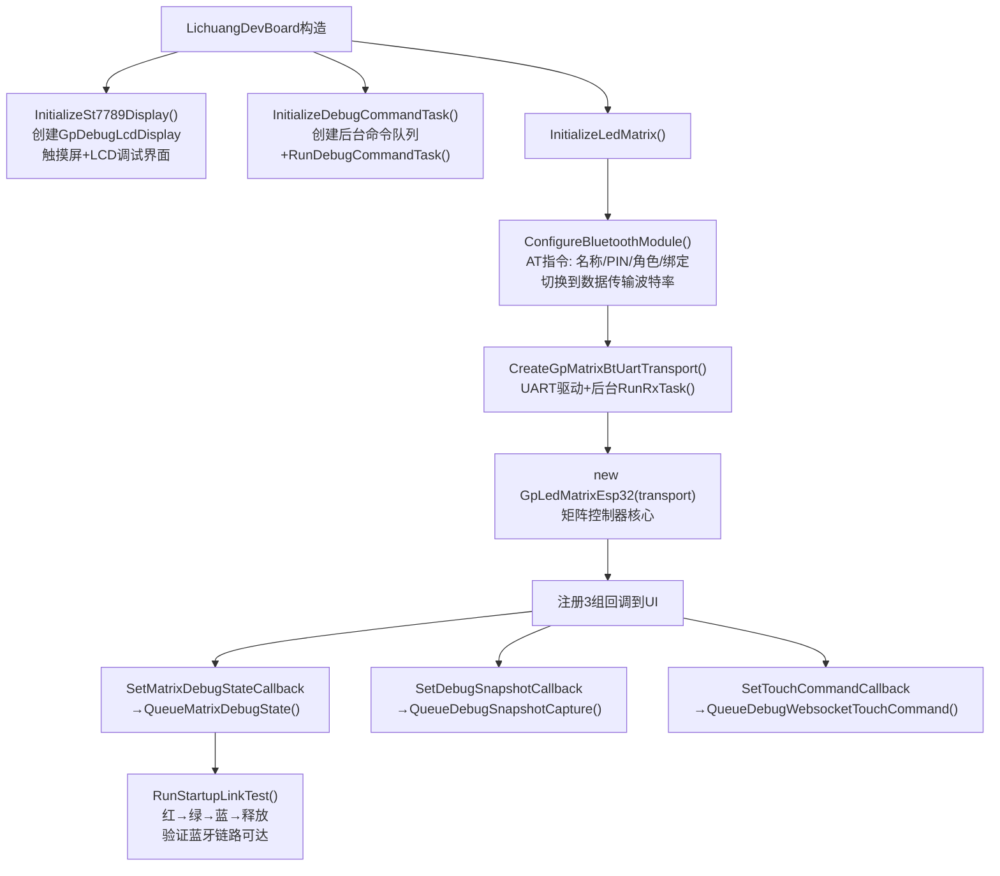
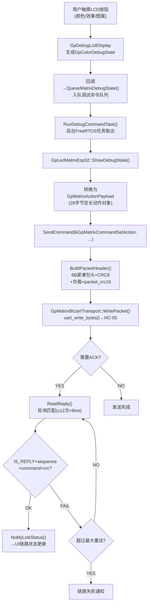
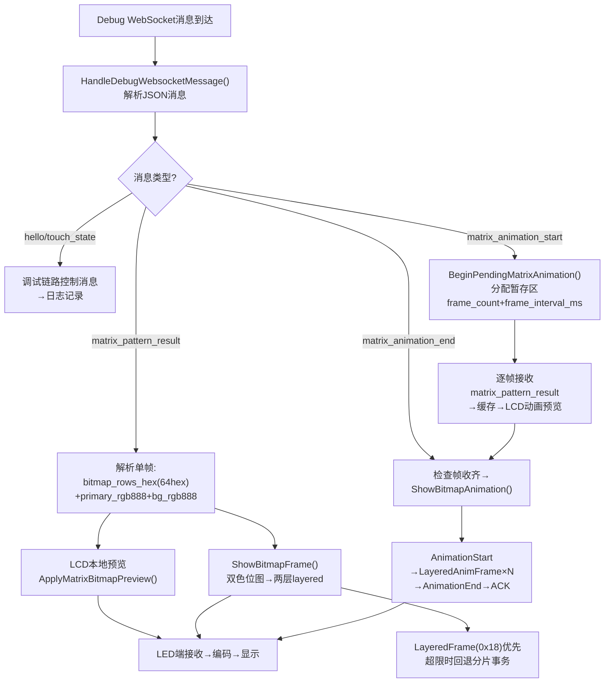
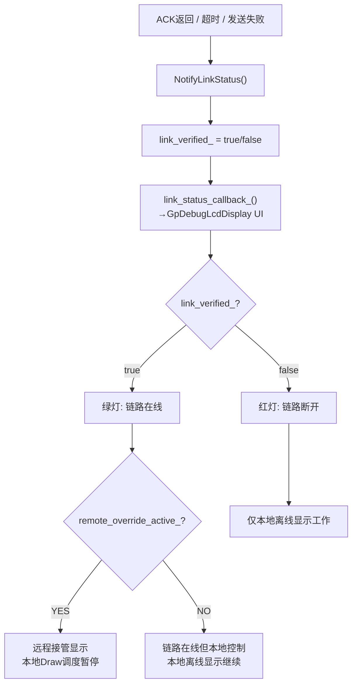

<!-- markdownlint-disable MD004 MD032 -->

# AI端接口调度软件结构与实现逻辑

## 1. 文档目的

本文档面向毕业论文撰写，专门说明 `AI端` 软件部分如何把本地调试状态、主机绘图结果、动画序列和蓝牙传输组织成一条可执行的控制链路。
说明范围集中于 `Project/xiaozhi-esp32/main/gp_port/` 及其直接相关的板级接入文件，重点回答以下问题：

1. `AI端` 如何把上层显示意图转换为共享蓝牙协议包。
2. `AI端` 如何等待 `LED端` ACK，并据此维护链路状态。
3. 触摸调试、HTTP 预览、Debug WebSocket 和蓝牙发送是如何在板级代码中汇合的。
4. 单帧显示、紧凑位图显示和动画批次在 `AI端` 内部采用了怎样的组织方式。

本文档对应仓库中的 `AI端接口调度` 分类。协议字段的唯一源头在 `Project/Protocols/`，主机侧绘图脚本与 MCP 桥接实现位于 `Project/Script/`，因此本文档重点解释 `AI端` 如何消费这些上游结果并将其转化为 `LED端` 可执行的数据流。

## 2. 软件总体分层

当前 `AI端` 控制链路可以划分为 5 层，自上而下分别如下。

### 2.1 板级接入层

- 位置：`main/boards/lichuang-dev/lichuang_dev_board.cc`
- 作用：
  - 初始化触摸屏、显示屏、音频、相机和网络等板级资源；
  - 创建 `GpLedMatrixEsp32` 与蓝牙传输对象；
  - 把本地 UI、MCP 工具、调试 HTTP 服务和 Debug WebSocket 统一接入矩阵控制链路。

这一层的职责是把“设备资源”组织成“可调度的软件能力”，属于系统集成层。

### 2.2 本地调试交互层

- 位置：`main/gp_port/ui/gp_debug_display.cc`
- 作用：
  - 提供触摸调试界面、状态面板、预览面板和 AI 链路状态显示；
  - 采集触摸侧的颜色、动画、图案和文本调试意图；
  - 将本地输入组织为 `GpColorDebugState` 等中间状态对象。

这一层不直接发送蓝牙数据，而是负责产生结构化的人机交互结果。

### 2.3 矩阵编排层

- 位置：`main/gp_port/gp_led_matrix_esp32.cc`
- 作用：
  - 把动作对象、RGB332 全帧、紧凑位图帧和动画批次转换为共享协议包；
  - 为每个请求生成序号、CRC 和 ACK 匹配信息；
  - 维护链路验证结果、成功/失败计数和远程接管状态。

这一层是 `AI端` 的核心控制层，其本质工作是把“显示语义”转换成“协议语义”。

### 2.4 蓝牙传输层

- 位置：`main/gp_port/transport/gp_led_matrix_transport.cc`
- 作用：
  - 通过 UART 驱动 HC-05；
  - 后台持续收集字节流并重组成完整协议包；
  - 为上层提供 `WritePacket/ReadPacket/DescribeLink` 抽象接口。

这一层把不稳定的串口字节流收敛成稳定的“整包输入/整包输出”接口，是 ACK 可靠匹配的基础。

### 2.5 远程预览与桥接协同层

- 位置：`main/boards/lichuang-dev/lichuang_dev_board.cc`
- 作用：
  - 按需提供 `POST /debug/preview_image` 与 `GET /debug/preview_status` 这组设备侧预览接口；
  - 按需建立 Debug WebSocket 通道，接收主机侧下发的 `matrix_pattern_result` 与动画消息；
  - 先在本地 LCD 预览，再决定是否转发到 `LED端`，避免调试服务常驻挤压内部 SRAM。

这一层将 `AI端` 从单纯的蓝牙发送器扩展为“预览缓冲 + 转发中枢”，使其既能服务本地交互，也能服务主机侧生成图像的调试闭环。

## 3. 核心对象与数据接口

为了便于论文说明，可以将 `AI端` 的关键对象归纳为表 3-1。

| 对象 / 接口 | 位置 | 作用 |
| --- | --- | --- |
| `GpLedMatrixEsp32` | `gp_led_matrix_esp32.cc` | 矩阵控制核心，负责打包、发包、等 ACK、统计链路状态 |
| `GpMatrixTransport` | `gp_led_matrix_transport.h` | 传输抽象接口，屏蔽具体 UART/HC-05 实现 |
| `GpMatrixBtUartTransport` | `gp_led_matrix_transport.cc` | UART + 后台收包实现 |
| `GpColorDebugState` | `gp_debug_display.h/.cc` | 本地调试界面的中间状态对象 |
| `BitmapAnimationFrame` | `gp_led_matrix_esp32.h/.cc` | 动画中单帧的紧凑位图表示 |
| `LichuangDevBoard` | `lichuang_dev_board.cc` | 板级总装配入口，串起 UI、网络、MCP 工具、预览和蓝牙 |

其中最关键的是 `GpLedMatrixEsp32`。从实现上看，它既不是单纯的 UI 控件，也不是单纯的串口驱动，而是位于两者之间的“协议控制器”。

## 4. 系统启动与初始化流程

`AI端` 启动后，并不是立即发送图像，而是先完成如下初始化工作。

### 4.1 HC-05 模块配置

在 `ConfigureBluetoothModule()` 中，板级代码通过 `Hc05UartConfigurator` 完成 HC-05 的 AT 配置。主要步骤包括：

1. 以 AT 波特率打开 UART；
2. 探测 `AT` 指令是否可达；
3. 设置本地名称、PIN 码、角色、绑定地址和固定连接模式；
4. 将远端模块与本地 UART 一起切换到数据传输波特率；
5. 输出最终的配置结果和当前波特率。

这一步的作用是把经典蓝牙链路固定为“`XiaoZhi -> WS2812`”的点对点数据通道，为后续协议发送提供稳定的物理基础。

### 4.2 创建传输对象与矩阵控制器

在 `InitializeLedMatrix()` 中，系统先调用 `CreateGpMatrixBtUartTransport(...)` 创建传输层对象，再构造：

```text
GpLedMatrixEsp32(transport, GP_MATRIX_DEFAULT_BRIGHTNESS)
```

这意味着从初始化完成开始，板级层不再直接操作 UART，而是统一通过 `GpLedMatrixEsp32` 暴露的高层接口执行显示控制。

### 4.3 注册 UI 与链路状态回调

当屏幕对象实际为 `GpDebugLcdDisplay` 时，板级层会继续注入 3 组回调：

1. `SetLinkStatusCallback`：把 ACK 成功/失败后的链路状态同步到 LCD 调试界面。
2. `SetMatrixDebugStateCallback`：把本地触摸调试状态放入调试命令队列，交由后台任务发送。
3. `SetTouchCommandCallback`：把触摸事件包装为 Debug WebSocket 消息，发往主机侧调试服务。

因此，`AI端` 的本地界面并不是直接操作底层串口，而是通过回调与任务队列间接驱动矩阵控制器。

### 4.4 启动蓝牙链路自检

后台任务 `RunBluetoothBridgeTask()` 在延时约 `1200 ms` 后调用 `RunStartupLinkTest()`。该函数会按顺序发送 3 个纯色动作：

1. 红色静态动作；
2. 绿色静态动作；
3. 蓝色静态动作；
4. 最后发送 `BuildReleaseAction()` 释放远程接管。

每个步骤之间间隔约 `1000 ms`。这样做的目的有两点：

1. 在上电初期快速验证蓝牙链路是否可达；
2. 在验证结束后恢复本地显示控制，避免长期占用 `LED端` 画面。

## 5. 从显示语义到协议包的核心转换过程

### 5.1 调试状态到动作对象

本地 UI 产生的 `GpColorDebugState` 不会直接进入串口，而是先由 `ShowDebugState()` 转换为 `GpMatrixActionPayload`。转换逻辑包括：

1. 依据 `preset` 判定当前是纯色、图案、JLU 徽标、十字图案还是滚动字幕；
2. 依据 `animation` 决定是静态、渐变还是呼吸效果；
3. 将 `primary_rgb888` 与可选的 `secondary_rgb888` 拆分为 3 个 8 位通道；
4. 根据动画周期计算 `anim_step`，根据点大小计算 `gradient_span`；
5. 最终调用 `ShowAction()` 发送固定 18 字节动作负载。

也就是说，本地调试界面提供的是“可读语义”，而发往 `LED端` 的是定长动作对象。

### 5.2 RGB332 全帧的发送流程

`ShowRgb332Frame()` 用于发送完整 `16 x 16` 的 RGB332 帧。其要求非常严格：

1. 输入指针不能为空；
2. 帧长度必须严格等于 `GP_MATRIX_RGB332_FRAME_SIZE = 256` 字节；
3. 发送时采用 `SendStagedFrame()` 统一组织为 `FrameStart + FrameChunk + FrameCommit`。

在 `SendStagedFrame()` 中，处理过程如下：

1. 先发送 `FrameStart`，负载为 `format + width + height + total_bytes_le16`；
2. 按 `64` 字节上限切片，每片前置 `byte_offset_lo + byte_offset_hi + size`；
3. 每发送一片都可以选择是否等待 ACK；
4. 最后用 `FrameCommit` 携带显示模式，通知 `LED端` 将新帧切换为当前显示内容。

由于 256 字节刚好需要 4 个 `64` 字节数据片，因此一帧完整 RGB332 图像的蓝牙传输是一个多阶段事务，而不是一次写串口即可完成。

### 5.3 紧凑位图单帧的发送流程

相比完整 RGB332 帧，`ShowBitmapFrame()` 使用的是更适合主机绘图链路的紧凑位图格式。该格式由两部分组成：

1. `16` 行位图数据，每行 `uint16_t`，合计 `32` 字节；
2. 前景色 `RGB888` 与背景色 `RGB888`，合计 `6` 字节。

因此，一帧紧凑位图总长度为：

```text
16 x 2 + 3 + 3 = 38 byte
```

当前实现里，`ShowBitmapFrame()` 已不再把 `38` 字节双色位图原样下发到蓝牙链路，而是先把“背景层 + 前景层”转换为两层 `LayeredFrameLayer`，再调用 `ShowLayeredFrameLocked()`。因此：

1. 若总层数不超过 `4` 层，且总负载不超过 `144` 字节，则优先使用 `LayeredFrame(0x18)` 单包发送；
2. 只有当分层负载超出单包范围时，才回退到 `FrameStart + FrameChunk + FrameCommit` 这条分片事务；
3. `38` 字节双色位图仍然是主机与 `AI端` 间的常用中间格式，但在 `AI端 -> LED端` 主链路上已经被统一折叠到 layered 单帧事务。

这一策略既保留了上层接口的简洁性，又减少了蓝牙链路上的握手轮次，非常适合主机绘图与本地调试时的快速预览。

### 5.4 动画批次的发送流程

`ShowBitmapAnimation()` 现在会先把每一帧双色位图转换为 layered 帧集合，再统一进入 `ShowLayeredAnimationLocked()`。它的处理流程为：

1. 检查帧数必须在 `1..32` 范围内；
2. 解析或修正 `frame_interval_ms`，过小则回退到默认 `42 ms`；
3. 发送 `AnimationStart`，声明格式、帧数、帧间隔和循环标志；
4. 对每一帧写入 `frame_index + layered_frame_payload`，具体命令为 `LayeredAnimFrame(0x19)`；
5. 最后发送 `AnimationEnd(frame_count)` 完成提交。

从实现上看，动画不是把 `32` 帧先膨胀为 `32 x 256` 字节 RGB332 再传输，而是保留 layered 紧凑表示，以减小蓝牙传输量和 `LED端` 解析压力。

## 6. ACK 机制与链路状态维护

### 6.1 发送侧包头与 CRC 组织

所有协议请求最终都由 `SendCommand()` 构造二进制包。其处理步骤为：

1. 根据是否要求 ACK 生成 `flags`；
2. 使用 `sequence_` 作为本次请求序号；
3. 直接写入当前固定 `6` 字节紧凑包头：`magic + flags + sequence + command + payload_length`；
4. 对前 `5` 字节计算 `header_crc8`；
5. 对 `header + payload` 计算 `packet_crc16`，附加在包尾。

这样，`AI端` 在发包时就同时完成了轻量头校验与整包校验的构造工作。

### 6.2 ACK 的读取与匹配

如果命令要求 ACK，`SendCommand()` 会立即调用 `ReadReply()`。读取过程并不是阻塞式地盲等一个字节流，而是执行如下匹配流程：

1. 先短暂延时，给 `LED端` 留出准备回包的时间；
2. 最多重试若干轮轮询，从传输层读取完整包；
3. 校验 `magic/header_crc8/payload_length` 是否与当前紧凑头一致；
4. 校验回包 `sequence` 是否等于当前请求的 `sequence`；
5. 校验 `command` 是否回显当前命令；
6. 校验 `flags` 是否带有 `IS_REPLY` 标志位，并校验整包 CRC16；
7. 解析 `status/detail/current_mode` 三字节回复负载。

只有当这些条件全部满足时，该 ACK 才被视为真正有效。由此可见，`AI端` 并不是“收到任何回复都算成功”，而是必须做到命令级别的一一对应。

### 6.3 链路在线与远程接管的区别

`AI端` 内部同时维护了两类状态：

1. `link_verified_` 表示最近一次协议交互是否得到了合法 ACK；
2. `remote_override_active_` 表示当前是否仍由远程动作接管 `LED端` 显示。

这两个状态分别回答两个不同的问题：

1. 蓝牙链路是否还能通信；
2. 当前画面是否仍由远程侧控制。

因此，即使链路在线，也未必意味着远程显示正在持续接管。论文写作时必须把“链路可达”与“显示控制权归属”区分开来。

## 7. 传输层的后台收包逻辑

`GpMatrixBtUartTransport` 的目标不是简单地暴露 `uart_write_bytes()`，而是把字节流收敛成可供上层直接消费的完整包。

### 7.1 UART 与队列初始化

在构造函数中，传输层完成以下初始化：

1. 创建 UART 驱动，配置独立的收发缓冲区；
2. 设置串口参数和 TX/RX 引脚；
3. 创建事件队列与协议包队列；
4. 启动后台 `RunRxTask()` 任务。

这意味着收包逻辑自启动开始便持续运行，不依赖上层主动轮询串口寄存器。

### 7.2 字节流到协议包的重组

后台任务收到 `UART_DATA`、溢出或帧错误等事件后，会调用 `PumpRxBytes()`，不断把串口中的字节读入 `rx_buffer_`。随后 `TryExtractPacket()` 执行如下处理：

1. 在缓冲区中查找协议魔数 `0x47`；
2. 在拥有完整 `6` 字节紧凑包头后校验 `header_crc8`；
3. 依据 `payload_length` 计算整包长度；
4. 在缓冲区内已收齐整包时校验 `packet_crc16`；
5. 通过后把整包拷入 `packet_queue_`，供 `ReadReply()` 或其他上层逻辑读取。

因此，协议级的边界判定和完整性校验已经在传输层完成，`GpLedMatrixEsp32` 只需要面向“完整包对象”工作即可。

### 7.3 回复包优先保留策略

实现中还存在一个细节：当包队列已满时，如果当前包是 `Reply`，传输层会尝试先取出一个旧包，再把新的回复包插入队列。这体现了 `AI端` 对 ACK 时效性的优先保证，因为上层最关心的通常不是历史请求，而是当前命令的确认结果。

## 8. 板级预览与 Debug WebSocket 协同机制

`AI端` 不只是协议发送者，还承担了本地预览缓冲和主机侧调试结果的接收职责。

### 8.1 设备侧 HTTP 预览服务

在板级文件中，`HandleDebugPreviewUpload()` 与 `HandleDebugPreviewStatus()` 组成了一组轻量 HTTP 端点：

1. `POST /debug/preview_image` 接收主机上传的 PNG 或 JPEG 图像，并将其放入 LCD 预览区；
2. `GET /debug/preview_status` 返回是否已就绪、最近一次图像大小和状态文本。

当前稳定版本中，这组 HTTP 端点及其底层 HTTP server 都采用按需启动策略：只有主机请求设备预览、查询状态或需要建立调试链路时才真正拉起。这样做的原因是矩阵预览链路要与语音音频链路共享内部 SRAM，常驻启动会挤压 `listening` 阶段的可用余量。

### 8.2 Debug WebSocket 的消息组织

`AI端` 还实现了一条 Debug WebSocket 客户端链路。连接建立后，设备会先发送 `hello`，随后能够处理以下几类主机消息：

1. `matrix_animation_start`：声明即将接收的动画帧数和帧间隔；
2. `matrix_pattern_result`：下发一帧紧凑位图结果；
3. `matrix_animation_end`：表示本次动画批次已经发送完成；
4. `ack` / `hello`：调试链路控制消息。

这条链路同样是按需建立的，不会在 Wi-Fi 刚连接时默认常驻。这样，主机不必直接操控蓝牙分片，而是先把“结构化图形结果”交给 `AI端`，由 `AI端` 再决定本地预览和蓝牙转发。

### 8.3 动画的本地缓存与再转发

当 `AI端` 收到 `matrix_animation_start` 后，会先调用 `BeginPendingMatrixAnimation(...)` 为本次动画分配暂存区。随后：

1. 每收到一条带 `frame_index/frame_count` 的 `matrix_pattern_result`，就写入对应暂存帧；
2. 同时在 LCD 预览面板更新当前动画预览；
3. 当 `matrix_animation_end` 到达且所有帧均已就绪后，再统一调用 `ShowBitmapAnimation(...)` 转发到 `LED端`。

这一步非常关键，因为它说明 `AI端` 对动画不是“收到一帧发一帧”，而是先缓存完整批次，再以协议定义的动画事务形式整体提交给 `LED端`。

## 9. 典型工作流示例

下面以“主机生成一帧位图图案并通过 Debug WebSocket 转发”为例说明 `AI端` 的整体执行逻辑。

### 9.1 主机侧输出结果

主机把 `bitmap_rows_hex`、`primary_rgb888` 和 `background_rgb888` 组织为 `matrix_pattern_result` 消息，通过 Debug WebSocket 发送给 `AI端`。

### 9.2 AI 端解析与预览

`HandleDebugWebsocketMessage()` 解析 JSON 后，会完成以下工作：

1. 校验 `bitmap_rows_hex` 与颜色字符串是否合法；
2. 将其解析为 `16` 行 `uint16_t` 位图数组和两个 `RGB888` 颜色值；
3. 在 `GpDebugLcdDisplay` 中更新本地矩阵预览。

### 9.3 AI 端蓝牙转发

随后 `AI端` 调用：

```text
ShowBitmapFrame(rows, 16, primary_rgb888, background_rgb888, kGpMatrixModeSolidFrame)
```

该调用会先把“背景层 + 前景层”折叠为两层 layered 负载，并进一步优先通过：

```text
LayeredFrame(0x18)
```

组织为单包协议事务，最终由 `GpMatrixBtUartTransport` 写入 HC-05 UART。只有当 layered 负载超出单包上限时，才回退到 `FrameStart -> FrameChunk -> FrameCommit` 的分片事务。

### 9.4 LED 端执行与 ACK 返回

`LED端` 收到事务后完成缓存写入和显示提交，再回复一个复用原 `sequence + command` 且带 `IS_REPLY` 标志位的 ACK 包。`AI端` 匹配成功后更新链路状态面板，至此形成完整的“主机生成 -> AI 端预览 -> 蓝牙转发 -> LED 端执行 -> ACK 回报”闭环。

## 10. 核心实现流程图

以下流程图以 Mermaid 格式描述 AI 端接口调度各关键环节的实现逻辑。

### 10.1 系统启动与初始化流程



### 10.2 本地触摸调试路径



### 10.3 WebSocket 绘图与动画转发路径



### 10.4 传输层后台收包与ACK匹配

```mermaid
flowchart TD
    subgraph RX["后台RX任务"]
        TASK1["RunRxTask()<br/>FreeRTOS任务 栈4K prio5"] --> WAIT["等待UART_DATA事件"]
        WAIT --> PUMP["PumpRxBytes()→rx_buffer_"]
        PUMP --> EXTRACT["TryExtractPacket()"]
      EXTRACT --> FIND["扫描魔数0x47"]
        FIND --> HCRC{"header_crc8?"}
        HCRC -->|"FAIL"| FIND
      HCRC -->|"OK"| WAIT2["等6B头+payload+CRC16收齐"]
        WAIT2 --> PCRC{"packet_crc16?"}
        PCRC -->|"FAIL"| FIND
        PCRC -->|"OK"| QUEUE["完整包→packet_queue_(16深度)<br/>Reply优先保留策略"]
    end

    subgraph ACKMATCH["ACK同步匹配"]
        SR["SendCommand()需要ACK"] --> DELAY["短暂延时→ReadReply()"]
        DELAY --> POPQ["从packet_queue_读包"]
      POPQ --> CHK{"校验magic/header_crc8?"}
        CHK -->|"FAIL"| RETRY["重试(≤12次×8ms)"]
      CHK -->|"OK"| CHK2{"IS_REPLY且sequence<br/>==原请求?"}
        CHK2 -->|"NO"| RETRY
        CHK2 -->|"YES"| CHK3{"command回显?"}
        CHK3 -->|"NO"| RETRY
        CHK3 -->|"YES"| CHK4{"packet_crc16?"}
        CHK4 -->|"OK"| OK["解析status/detail<br/>/current_mode"]
        CHK4 -->|"FAIL"| RETRY
        RETRY -->|"超限"| FAIL2["链路失败"]
        OK --> UI["NotifyLinkStatus()→UI"]
    end
```



### 10.5 链路状态与远程接管判定



## 11. 本章小结

从软件结构上看，`AI端` 的价值不在于直接生成底层 PWM 数据，而在于充当整个系统的软件中枢：

1. 它把本地 UI、主机绘图、HTTP 预览和蓝牙链路统一到同一套对象模型中；
2. 它通过 `GpLedMatrixEsp32` 将显示语义稳定映射为协议语义；
3. 它通过 ACK 机制、队列化调试命令和后台收包任务提升了链路可靠性；
4. 它通过本地预览和动画缓存，把“调试可观察性”与“最终 LED 显示执行”解耦开来。

因此，在整个毕业设计的软件系统中，`AI端` 并不是简单的蓝牙发射器，而是连接人机交互、主机绘图服务和 `LED端` 驱动执行层的核心调度节点。
