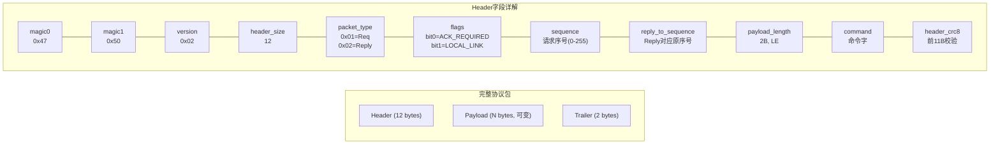
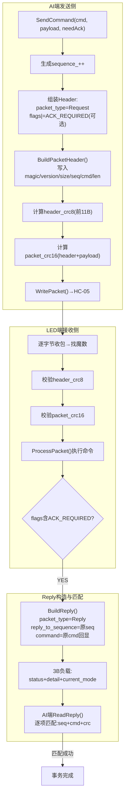
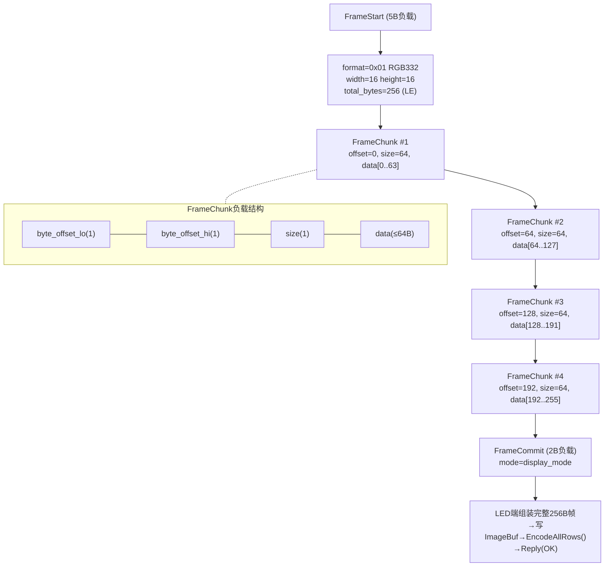
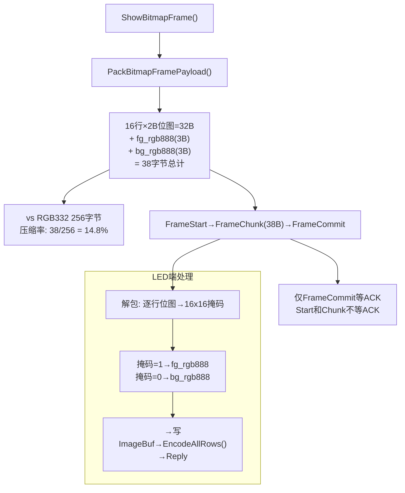
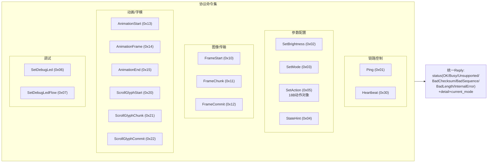

<!-- markdownlint-disable MD004 MD032 -->

# 蓝牙通信协议结构与实现逻辑

## 1. 文档目的

本文档面向毕业论文撰写，专门说明本项目 `AI端` 与 `LED端` 之间的共享蓝牙通信协议。说明范围集中于 `Project/Protocols/` 及其在 `AI端` 与 `LED端` 中的实现落点，重点回答以下问题：

1. 协议为什么采用“包头 + 负载 + CRC”的二进制结构。
2. 单帧、动作、滚动字模和动画批次在协议层分别采用什么负载格式。
3. `AI端` 如何构包、`LED端` 如何验包，以及 ACK 如何与请求一一匹配。
4. 主机绘图结果为何优先使用紧凑位图格式，而不是始终传输 256 字节 RGB332 整帧。

本文档对应仓库中的 `蓝牙通信协议` 分类。需要说明的是，本文档只负责协议格式和事务语义，不负责具体的串口驱动细节，也不负责 `LED端` 内部如何把最终数据变成 PWM 波形。

## 2. 协议设计目标与边界

当前协议服务于一条明确的主链路：

```text
主机绘图 / 本地 UI -> AI端 -> 经典蓝牙 SPP / HC-05 -> LED端
```

从设计上看，协议优先追求以下 5 点目标：

1. 可定界性：在连续字节流中能够快速找到包起点。
2. 完整性：既要校验包头，也要校验整包，避免误判和静默花屏。
3. 可扩展性：允许未来增加字段和命令，而不重写整个状态机。
4. 易匹配性：ACK 必须能回指到具体请求，而不是仅返回一个模糊的“成功/失败”。
5. 低带宽适配：在 HC-05 + UART 环境下，尽量减少不必要的传输字节数。

因此，该协议既不是纯文本协议，也不是只适合大带宽网络的冗长 JSON 协议，而是一套为串口蓝牙链路量身裁剪的轻量二进制协议。

## 3. 包结构与字段语义

协议头在 `gp_led_matrix_protocol.h` 中定义为 `GpMatrixPacketHeader`，总长度固定为 `12` 字节。整包格式如表 3-1 所示。

| 字段 | 长度 | 含义 |
| --- | --- | --- |
| `magic0` | 1 | 固定为 `0x47` |
| `magic1` | 1 | 固定为 `0x50` |
| `version` | 1 | 当前协议版本，固定为 `0x02` |
| `header_size` | 1 | 当前固定为 `12` |
| `packet_type` | 1 | `Request` 或 `Reply` |
| `flags` | 1 | 当前主要包含 ACK 请求位和本地链路位 |
| `sequence` | 1 | 当前请求序号，循环递增 |
| `reply_to_sequence` | 1 | Reply 对应的原请求序号 |
| `payload_length` | 2 | 负载长度，小端序 |
| `command` | 1 | 命令字 |
| `header_crc8` | 1 | 前 11 字节的 CRC8 |
| `payload` | N | 命令负载 |
| `packet_crc16` | 2 | 对 `header + payload` 的 CRC16 |

### 3.1 双层校验的原因

协议同时引入 `header_crc8` 与 `packet_crc16`，其原因并不是重复计算，而是分别服务于两个不同的阶段。

1. `header_crc8` 负责“能否相信包头”。
2. `packet_crc16` 负责“整个包是否完整无误”。

在接收侧，系统必须先在 12 字节包头范围内完成 `magic/version/header_size/header_crc8` 检查，只有通过后，才允许使用 `payload_length` 推导后续还需要收多少数据。这样可以有效避免因为偶发串口噪声而错误解读长度字段。

### 3.2 请求与回复的统一结构

协议中没有单独定义“状态命令”或“错误命令”。相反，它采用统一规则：

1. 请求包使用 `packet_type = Request`；
2. 回复包使用 `packet_type = Reply`；
3. Reply 的 `command` 直接回显原命令；
4. `reply_to_sequence` 指向原请求的 `sequence`。

这种设计的优点是，任何命令都可以拥有统一的 ACK 语义，不必再为每类业务额外设计一套回包命令字。

## 4. 命令集合与负载格式

### 4.1 基础命令集合

当前协议支持的核心命令如下。

| 命令 | 值 | 作用 |
| --- | --- | --- |
| `Ping` | `0x01` | 通链探测 |
| `SetBrightness` | `0x02` | 设置整体亮度 |
| `SetMode` | `0x03` | 设置显示模式 |
| `StateHint` | `0x04` | 同步 `AI端` 当前状态 |
| `SetAction` | `0x05` | 下发定长动作对象 |
| `SetDebugLed` | `0x06` | 控制 `LED端` 板载调试 LED |
| `SetDebugLedFlow` | `0x07` | 启停调试 LED 流水测试 |
| `FrameStart/Chunk/Commit` | `0x10/0x11/0x12` | 分片传输单帧图像 |
| `AnimationStart/Frame/End` | `0x13/0x14/0x15` | 传输动画批次 |
| `ScrollGlyphStart/Chunk/Commit` | `0x20/0x21/0x22` | 传输滚动字模 |
| `Heartbeat` | `0x30` | 保活 |

### 4.2 Reply 负载格式

Reply 的负载总长度固定为 `3` 字节，其定义为 `GpMatrixReplyPayload`：

1. `status`：状态码；
2. `detail`：细化失败原因；
3. `current_mode`：`LED端` 当前显示模式。

其中 `status` 的典型取值为：

1. `0x00` 成功；
2. `0x01` 忙；
3. `0x02` 不支持；
4. `0x03` 校验失败；
5. `0x04` 序号异常；
6. `0x05` 长度异常；
7. `0x7F` 内部错误。

而 `detail` 用于进一步指出失败细节，例如 `HeaderCrc`、`PacketCrc`、`PayloadLength`、`ChunkOffset` 或 `ChunkSize`。

### 4.3 动作负载 `SetAction`

`SetAction` 使用固定长度 `18` 字节的 `GpMatrixActionPayload`。其本质是将 `AI端` 的调试状态和显示意图压缩为一个可直接执行的动作对象，主要字段包括：

1. 来源 `source`；
2. 内容类型 `content`；
3. 效果类型 `effect`；
4. 显示方向 `direction`；
5. 颜色模式 `color_mode`；
6. 亮度 `brightness`；
7. 主色和次色各 3 字节；
8. `pattern_id` 与 `glyph_id`；
9. `scroll_step`、`anim_step`、`gradient_span`；
10. `flags`，用于标记是否使用次色、是否启用远程接管、是否释放远程接管。

这种设计的意义在于：当用户只是切换纯色、图案或效果时，无需传输整帧图像，直接下发一个定长动作对象即可。

### 4.4 RGB332 整帧事务

完整 RGB332 帧的基本特征如下：

1. 固定分辨率 `16 x 16`；
2. 每像素 1 字节；
3. 一帧总长度 `256` 字节；
4. 数据格式编号为 `GP_MATRIX_PAYLOAD_FORMAT_RGB332 = 0x01`。

由于 `GP_MATRIX_MAX_CHUNK_DATA = 64`，单帧必须使用 3 个命令组成一个事务：

1. `FrameStart`：声明格式、宽度、高度和总长度；
2. `FrameChunk`：传输片内数据；
3. `FrameCommit`：通知 `LED端` 将已接收缓存切换为当前显示帧。

`FrameChunk` 的前缀固定为 `3` 字节：

1. `byte_offset_lo`
2. `byte_offset_hi`
3. `size`

因此，一帧 256 字节 RGB332 图像在协议层会被表示为：

```text
FrameStart(5B)
FrameChunk(offset=0, size=64)
FrameChunk(offset=64, size=64)
FrameChunk(offset=128, size=64)
FrameChunk(offset=192, size=64)
FrameCommit(mode=...)
```

### 4.5 紧凑位图 RGB888 单帧

为了更好适配主机绘图与动画输入，本项目又定义了 `GP_MATRIX_PAYLOAD_FORMAT_BITMAP_RGB888 = 0x03`。该格式的本质是“1 位位图 + 两个 RGB888 颜色”。其长度计算如下：

1. `16` 行位图，每行 `16` 位，共 `32` 字节；
2. 前景色 `RGB888`，共 `3` 字节；
3. 背景色 `RGB888`，共 `3` 字节。

因此整帧总长度为：

```text
32 + 3 + 3 = 38 byte
```

这一格式的优势是：当图像本质上只是“某个位图轮廓 + 前景/背景色”时，没有必要传输 256 字节 RGB332 数据，只需传输 38 字节即可。对 HC-05 链路而言，这种压缩会显著降低时延和错误概率。

### 4.6 动画批次事务

动画批次使用 `AnimationStart/AnimationFrame/AnimationEnd` 三类命令：

1. `AnimationStart` 负载长度为 `5` 字节，包含格式、帧数、帧间隔和循环标志；
2. `AnimationFrame` 前缀长度为 `1` 字节，即 `frame_index`；
3. 每帧的实际内容仍使用 38 字节紧凑位图负载；
4. `AnimationEnd` 使用 `1` 字节 `frame_count` 确认本批次结束。

协议头中规定：

1. 最大动画帧数为 `24`；
2. 合法帧间隔范围为 `1..65535 ms`；
3. 默认动画间隔为 `42 ms`；
4. 当前动画标志位支持循环播放。

可以看出，动画并不是协议层面的“逐帧临时显示”，而是一次完整的批量下载事务，目的是让 `LED端` 把整组帧缓存下来，再自行循环播放。

### 4.7 滚动字模事务

滚动字模使用 `ScrollGlyphStart/ScrollGlyphChunk/ScrollGlyphCommit` 这组三阶段命令。其特点是：

1. 单个字模以 `16` 行 `uint16_t` 表示；
2. `ScrollGlyphStart` 会声明字数、字宽、字距和总字节数；
3. `ScrollGlyphChunk` 使用与图像分片相同的显式字节偏移前缀；
4. `ScrollGlyphCommit` 用于通知 `LED端` 进入滚动显示状态。

这说明协议层将“字模数据传输”和“进入滚动模式”进行了显式分离，使接收侧更容易处理失败回滚和 ACK 反馈。

## 5. 协议的收发实现逻辑

### 5.1 AI 端发送侧实现

在 `AI端` 中，所有命令最终都会进入 `GpLedMatrixEsp32::SendCommand()`。其执行顺序为：

1. 生成请求序号 `sequence`；
2. 依据命令是否需要 ACK 设置 `flags`；
3. 构造包头并写入 `payload_length`；
4. 计算 `header_crc8`；
5. 拷贝负载；
6. 对 `header + payload` 计算 `packet_crc16`；
7. 调用传输层写包；
8. 若要求 ACK，则调用 `ReadReply()` 进行匹配。

因此，`AI端` 的上层业务代码完全不需要理解串口字节边界，而只需要提供命令字与负载内容。

### 5.2 AI 端接收侧实现

`GpMatrixBtUartTransport` 内部维护了一个后台 `RX` 任务和一个 `rx_buffer_`。其收包逻辑为：

1. 从 UART 读出任意长度字节块；
2. 在缓存中查找协议魔数；
3. 校验头部版本、长度和 `header_crc8`；
4. 根据头部长度和负载长度判断整包是否收齐；
5. 校验整包 CRC16；
6. 把完整包放入队列，供上层读取。

该实现说明协议已经把“包边界”和“数据正确性”问题下沉到传输层解决，上层只处理合法协议对象。

### 5.3 LED 端接收与执行原则

`LED端` 接收实现位于 `gp_led_matrix_ai8051u.c`。从系统职责划分来看，它主要遵循以下原则：

1. 先组包、再验证、后执行；
2. 在通过包头校验之前，不能信任 `payload_length`；
3. 对需要 ACK 的命令，优先返回明确的状态信息；
4. 动作对象、整帧图像、滚动字模和动画批次最终都要交由 `GpLedAction` 或底层显示驱动处理。

因此，协议层既是 `AI端` 的发送格式，也是 `LED端` 的统一接收契约。

## 6. 典型事务时序示例

### 6.1 动作切换事务

当用户在 `AI端` 界面上选择“纯色红色 + 静态显示”时，协议交互可概括为：

```text
AI端: SetAction(18B payload, ACK_REQUIRED)
LED端: Reply(status=OK, detail=0, current_mode=...)
```

该事务短、快、负载小，适用于大多数效果切换场景。

### 6.2 完整 RGB332 单帧事务

当需要直接显示一张 256 字节 RGB332 图像时，协议交互为：

```text
FrameStart
FrameChunk x 4
FrameCommit
Reply
```

其中真正的数据体量主要集中在 4 个 `FrameChunk` 中，ACK 一般绑定在关键阶段，便于确认接收侧已经完整缓存整帧。

### 6.3 紧凑位图单帧事务

若上游提供的是 `bitmap_rows_hex + primary_rgb888 + background_rgb888`，则 `AI端` 可直接组织为 38 字节紧凑位图事务。其优势是：

1. 蓝牙传输量从 256 字节降到 38 字节；
2. 主机只需维护位图和颜色，不必自己展开 RGB332；
3. 对单帧预览和快速交互更友好。

### 6.4 动画批次事务

对动画而言，完整时序通常为：

```text
AnimationStart(frame_count, frame_interval_ms)
AnimationFrame(index=0)
AnimationFrame(index=1)
...
AnimationFrame(index=N-1)
AnimationEnd(frame_count)
Reply
```

在这一事务中，协议承担的是“整批交付”的语义，而不是“逐帧直播”的语义。

## 7. 协议一致性约束与错误处理

为了保证多端实现一致，论文中应明确以下约束。

1. 命令字、负载长度、动画上限和 CRC 算法必须统一以 `gp_led_matrix_protocol.h` 为准。
2. 所有多字节字段统一按 little-endian 序列化。
3. ACK 匹配必须同时满足 `packet_type=Reply`、`reply_to_sequence=original_sequence` 和 `command=original_command`。
4. 分片事务中，`byte_offset` 必须与数据实际写入偏移一致，不能使用隐式推断。
5. 当主机已拥有紧凑位图时，应优先使用 38 字节紧凑格式，而不是重新膨胀为 256 字节整帧。
6. 动画超过 `24` 帧时，应由主机桥接层先做重采样和节拍缩放，而不是把超限负担转移给 `LED端`。

这些约束共同保证了协议不仅“能跑通”，而且“能在多端演进中保持一致”。

## 8. 协议核心流程图

以下流程图以 Mermaid 格式描述蓝牙通信协议各关键环节的实现逻辑。

### 8.1 数据包结构



### 8.2 Request/Reply 事务模型



### 8.3 RGB332 整帧分片传输事务



### 8.4 紧凑位图单帧传输



### 8.5 动画批次事务

```mermaid
flowchart TD
    ANIM["ShowBitmapAnimation()"] --> CHECK{"帧数≤24?"}
    CHECK -->|"YES"| AS["AnimationStart(5B负载)<br/>format=0x03 BITMAP_RGB888<br/>frame_count, frame_interval_ms<br/>flags(循环标志)"]
    CHECK -->|"超额"| HOST ["主机侧重采样"]

    AS --> LOOP["逐帧发送 AnimationFrame"]
    LOOP --> FRAME["每帧:<br/>frame_index(1B)<br/>+38B紧凑位图负载"]
    FRAME --> MORE{"还有帧?"}
    MORE -->|"YES"| LOOP
    MORE -->|"NO"| AE["AnimationEnd (1B frame_count)"]

    AE --> LEDPROC["LED端处理"]
    LEDPROC --> CACHE["缓存全部帧到动画缓冲"]
    CACHE --> PLAY["GpLedAction_Tick1ms()<br/>按frame_interval_ms切换帧"]
    PLAY --> LOOPCHK{"循环?"}
    LOOPCHK -->|"YES"| PLAY
    LOOPCHK -->|"NO"| DONE["动画播放完毕→Reply"]
```

### 8.6 命令集合与分类



## 9. 本章小结

综合来看，本项目的蓝牙通信协议具有以下特点：

1. 采用轻量二进制格式，适配 HC-05 + UART 的带宽和实时性约束；
2. 通过双层 CRC 和显式 `Reply` 结构，提高了链路可靠性；
3. 通过动作对象、紧凑位图和动画批次三类语义化负载，兼顾了实时控制和高效传输；
4. 通过统一协议头和共享头文件，使 `AI端`、`LED端` 与主机侧桥接脚本能够围绕同一套契约协同演进。

因此，该协议不仅是数据传输格式，更是整个软件系统跨设备协作的公共语言。
