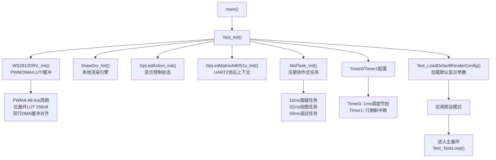
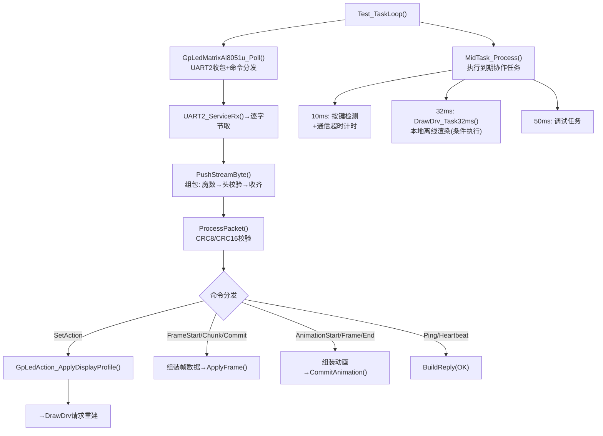
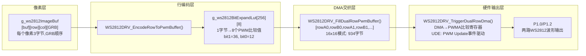
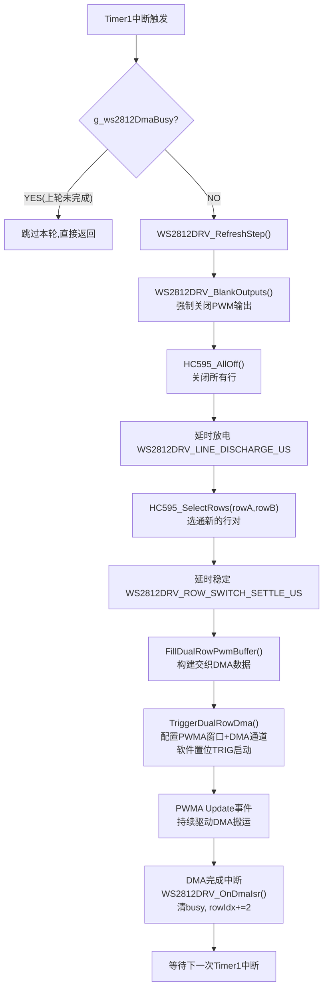
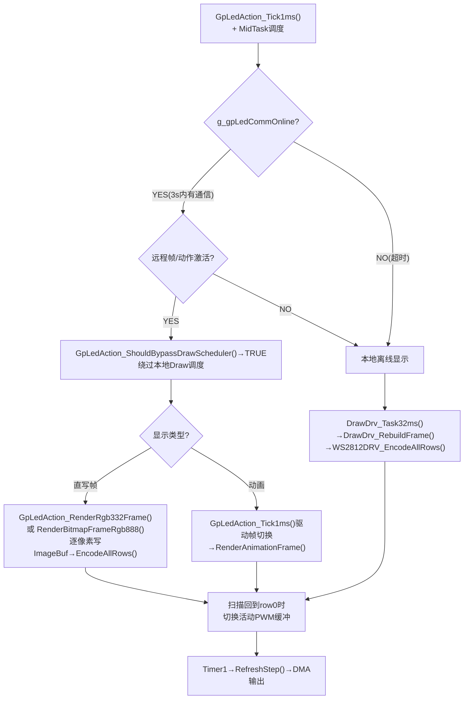
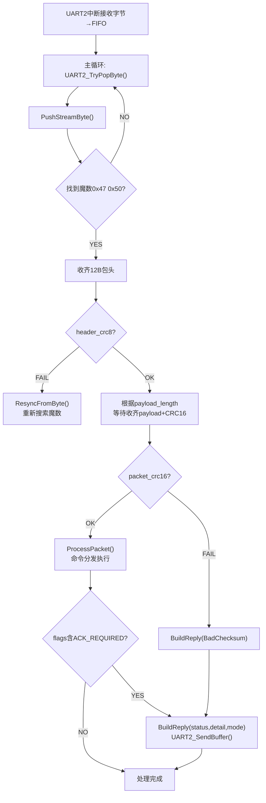

<!-- markdownlint-disable MD004 MD032 -->

# LED端显示驱动软件结构与实现逻辑

## 1. 文档目的

本文档面向毕业论文撰写，专门说明 LED 端显示驱动的软件结构与实现逻辑。说明范围集中于
`Project/STC51/ws2812_driver/`，重点回答以下问题：

1. LED 端如何利用 PWM + DMA 生成 WS2812 所需的时序波形。
2. 16x16 点阵如何通过双通道扫描方式完成逐行刷新。
3. 图像数据如何从上层图案/字模/远程帧数据逐层转换为底层 PWM 发送序列。
4. 本地离线显示、远程控制显示、动画播放三种显示路径如何在软件中统一。

本文档不是调试记录，而是偏论文式的软件架构说明，因此在叙述时按“分层结构、数据流、时序流”的方式展开。

### 1.1 文档边界与分类位置

按照当前仓库的软件分类，本文档只覆盖 `LED端显示驱动`，也就是
`Project/STC51/ws2812_driver/` 内部从图像缓存、动作执行到 PWM + DMA 刷新输出的完整链路。
以下内容只作为边界说明，不在本文档中展开替代：

1. `AI端` 的动作生成、蓝牙发包、ACK 轮询和板级预览组织，属于
   `Project/xiaozhi-esp32/main/gp_port/`。
2. 共享包头、命令字、长度约束、CRC 和动画批次格式，属于
   `Project/Protocols/`。
3. 主机侧 MCP 绘图、HTTP/WebSocket 预览桥和联调自动化，属于
   `Project/Script/`。

论文撰写时还需要特别区分两个容易混淆的概念：

1. `链路在线` 表示 `AI端` 与 `LED端` 的通信链路仍然有效，能够继续收发协议包。
2. `远程接管显示` 表示当前屏幕内容已经被远程动作、远程单帧或远程动画实际占有。

前者强调“能否通信”，后者强调“谁在控制当前显示内容”。二者并不等价，这一区分对于解释
本地离线显示与远程显示的协同关系非常重要。

## 2. 软件总体分层

当前 LED 端显示驱动可以划分为 6 层，自底向上分别如下。

### 2.1 硬件波形驱动层

- 位置：`Sources/drv/ws2812_drv.c`、`Sources/drv/hc595_drv.c`
- 作用：
  - 配置 PWMA 双通道输出；
  - 通过 PWMAT-DMA 自动搬运占空比序列；
  - 通过 74HC595 选择当前需要点亮的两行；
  - 在定时器中断驱动下持续完成行扫描刷新。

这一层直接面向 AI8051U 的定时器、PWM、DMA、GPIO 和外部 74HC595 行选硬件，属于强实时层。

### 2.2 帧缓存与编码层

- 位置：`Sources/drv/ws2812_drv.c`
- 作用：
  - 保存待显示图像；
  - 将 RGB 像素转换为 WS2812 位流对应的 PWM 占空比序列；
  - 维护活动 PWM 缓冲区与待切换 PWM 缓冲区。

这一层的核心职责是把“颜色信息”转换成“可被 DMA 直接发送的时序数据”。

### 2.3 图像渲染层

- 位置：`Sources/mid/draw_drv.c`、`Sources/mid/offline_pattern.c`
- 作用：
  - 生成本地图案、文字、纯色画面；
  - 执行渐变、呼吸、淡入淡出、滚动、颜色循环等效果；
  - 将离线资源转写到 WS2812 驱动的图像缓冲。

这一层处理的是“显示内容长什么样”，而不是“怎么发出去”。

### 2.4 动作与显示控制层

- 位置：`Sources/mid/gp_led_action.c`
- 作用：
  - 统一管理本地离线显示与远程在线显示；
  - 处理远程动作配置、整帧直写、动画上传与播放；
  - 决定何时绕过本地 Draw 调度，直接由远程帧接管显示。

这一层是显示策略层，负责决定当前屏幕内容来自哪里。

从实现语义上看，这一层并不是简单判断“蓝牙是否在线”，而是要进一步判断“远程内容是否处于接管状态”。
也就是说，即使链路仍然在线，只要没有远程动作或远程帧持续占有显示面板，本地离线图案与按键逻辑仍然可以继续工作。

### 2.5 通信接入层

- 位置：`Sources/drv/gp_led_matrix_ai8051u.c`、`Project/Protocols/gp_led_matrix_protocol.h`
- 作用：
  - 通过 UART2 接收字节流；
  - 组包、校验、解析命令；
  - 将协议命令转交给 `GpLedAction`。

这一层不直接绘图，而是把“主机命令”翻译为 LED 端可执行的动作。

### 2.6 调度与运行时组织层

- 位置：`Sources/app/app.c`、`Sources/mid/mid_task.c`、`Sources/drv/timer.c`
- 作用：
  - 建立 1 ms 软件调度节拍；
  - 建立独立的行刷新定时器；
  - 在主循环中轮询通信与执行协作式任务。

这一层将强实时刷新与弱实时渲染/协议处理分离，是整个系统稳定运行的关键。

## 3. 系统启动与运行主线

LED 端的主流程可以概括为：

`main -> Test_Init -> Test_TaskLoop`

其中初始化阶段主要完成以下工作：

1. `WS2812DRV_Init()` 初始化 PWM、DMA、位展开查找表和底层缓存。
2. `WS2812DRV_SetDisplayMode(WS2812DRV_MODE_16X16)` 设置当前为 16x16 显示模式。
3. `DrawDrv_Init()` 初始化离线渲染参数，并构建初始帧。
4. `GpLedAction_Init()` 初始化显示控制状态。
5. `GpLedMatrixAi8051u_Init()` 初始化协议上下文。
6. `MidTask_Init()` 注册 10 ms 按键/控制任务、32 ms 绘图任务、调试任务。
7. `Test_Timer1ApplyRefreshInterval()` 配置 Timer1，用于驱动 LED 行扫描刷新。
8. `TIMER0_StartOneShotUs(1000)` 建立 1 ms 软件调度节拍。

初始化完成后，系统形成两条并行运行路径：

1. 强实时刷新路径
   - `Timer1 ISR -> WS2812DRV_RefreshStep() -> 行选切换 -> PWMAT-DMA 发送`
2. 协作式业务路径
   - `main loop -> GpLedMatrixAi8051u_Poll() -> MidTask_Process()`

这两条路径分别处理“当前屏幕怎么稳定显示”与“下一帧内容应该是什么”。

## 4. PWM + DMA 驱动原理

### 4.1 采用 PWM 表示 WS2812 位编码

WS2812 的本质要求不是普通 GPIO 电平翻转，而是对每一位数据输出一段固定周期、不同高电平占空比的脉冲。
因此，本工程没有采用纯软件逐位拉高拉低的方式，而是采用以下方案：

1. 将每个数据位预先编码成一个 PWM 占空比值；
2. 通过 DMA 自动把占空比值写入 PWM 比较寄存器；
3. 让硬件连续输出整串位流。

在 `ws2812_drv.h` 中：

- `WS2812DRV_PWM_DUTY_BIT0 = 12`
- `WS2812DRV_PWM_DUTY_BIT1 = 36`

在 `WS2812DRV_PWMAConfig()` 中：

- 系统主频为 `FOSC = 33177600 Hz`；
- PWMA 使用 1T 模式；
- 自动重装值设置为 `48 - 1`；
- CH1 与 CH2 均工作在 PWM 输出模式。

因此，驱动层并不直接关心单个位该拉高多久，而是把逻辑位 `0/1` 映射为两种固定的比较值，
由 PWMA 自动输出波形。这样做有两个明显优点：

1. 时序由硬件外设保证，抖动显著小于纯软件 bit-bang。
2. CPU 不必参与逐位发送，只需要准备数据缓冲。

### 4.2 使用查找表降低编码开销

为了避免每次编码都逐位判断，驱动在 `WS2812DRV_InitBitExpandLut()` 中预先建立了
`g_ws2812BitExpandLut[256][8]` 查找表。

其含义是：

- 输入一个 8 位数据字节；
- 直接得到该字节展开后的 8 个 PWM 占空比值；
- 若该位为 1，则填入 `WS2812DRV_PWM_DUTY_BIT1`；
- 若该位为 0，则填入 `WS2812DRV_PWM_DUTY_BIT0`。

这样，在编码像素数据时，软件不需要再逐位计算，只需查表并顺序拷贝即可。

### 4.3 使用 PWMAT-DMA 自动发送占空比流

在 `WS2812DRV_TriggerDualRowDma()` 中，驱动将双行交织后的 PWM 缓冲地址写入 DMA 控制寄存器，
并设置 DMA 的目标地址为 PWM 比较寄存器起始地址。

具体实现逻辑如下：

1. DMA 数据源是内存中的双行 PWM 缓冲区；
2. 目标地址从 `CCR1H` 开始；
3. 因为采用双通道输出，所以 DMA 以交织方式更新 CH1/CH2 的比较值；
4. 启动 DMA 后，PWM 外设边输出边请求下一组比较值。

这里的关键点是：CPU 只负责“启动一次 DMA 传输”，并不负责“每个 PWM 周期都去写寄存器”。

### 4.4 DMA 对齐保护与结束处理

驱动中专门保留了 `g_ws2812DualRowPwmBufRaw` 和 `g_ws2812DualRowPwmBuf` 两个指针，
通过 `WS2812DRV_InitDualRowDmaBuffer()` 保证真正用于 DMA 发送的缓冲区起始地址为偶地址。

这样设计的原因是：当前 DMA 发送的是 CH1/CH2 交织数据流，若源地址未对齐，会破坏双通道比较值的配对关系，
导致错误波形输出。因此：

1. 初始化阶段主动对齐 DMA 缓冲区首地址；
2. 发送前再次检查地址是否为偶数；
3. 一旦发现奇地址，直接拒绝发送并关闭输出。

DMA 发送完成后，会进入 `PWMAT_DMA_ISR()`，然后转调 `WS2812DRV_OnDmaIsr()`：

- 清除 DMA 忙标志；
- 记录 DMA 完成计数；
- 清 DMA 状态位。

因此，DMA 中断只做最小量的状态收尾，不在中断内做复杂逻辑。

## 5. 行扫描与双通道输出机制

### 5.1 为什么不是一次性驱动 256 个像素

虽然逻辑显示区域是 16x16，但底层硬件并不是为每个像素单独配置一条独立数据输出线。
当前工程采用的是双通道数据输出 + 行选扫描方案，即：

1. PWM 两个通道分别承载两路 WS2812 数据流；
2. 74HC595 负责选通当前需要刷新的行；
3. 通过快速轮询不同的行对，实现整屏显示。

这是一种典型的“空间换时间”方案：用较少的高速发送通道，配合定时扫描，实现更大面积的点阵驱动。

### 5.2 74HC595 行选的作用

`hc595_drv.c` 中的 `HC595_SelectRows(rowA, rowB)` 会把 16 位行选信号移入 74HC595，
其中被选中的行为低电平有效，其余行为关闭。

对应实现流程为：

1. 先构造 `0xFFFF` 全关状态；
2. 再清除 `rowA` 与 `rowB` 对应位；
3. 通过串行移位方式写入 74HC595；
4. 锁存后两行同时被选通。

为了避免中断打断移位过程，`HC595_Write16()` 在移位期间关闭总中断，保证行选不会被破坏。

### 5.3 行切换前为何要先灭屏

`WS2812DRV_SelectRows()` 在切换行之前，先执行：

1. `WS2812DRV_BlankOutputs()` 强制关闭 PWM 输出；
2. `HC595_AllOff()` 关闭所有行；
3. 延时 `WS2812DRV_LINE_DISCHARGE_US`；
4. 再选中新行；
5. 再延时 `WS2812DRV_ROW_SWITCH_SETTLE_US`。

这一步的目的是避免以下问题：

1. 上一行残余电荷尚未释放时直接切换到下一行，造成串扰；
2. 行选刚切换完成时立即发送数据，导致边沿不稳；
3. PWM 数据线与行选信号不同步，产生错误点亮。

因此，先灭屏、再切行、最后发送，是保证扫描稳定性的必要步骤。

### 5.4 正常双行扫描模式

系统默认使用 `WS2812DRV_SCAN_NORMAL_PAIR` 模式。在 `WS2812DRV_RefreshStep()` 中：

1. `rowA = g_ws2812ScanRowIdx`
2. `rowB = rowA + 1`
3. 从当前活动 PWM 行缓冲中取出这两行的编码结果；
4. 交织成一段双通道 DMA 数据；
5. 触发行选与 DMA 发送；
6. 下一次刷新时行索引加 2。

因此，完整刷新一帧只需扫描 8 个行对，而不是 16 次单行发送，刷新效率更高。

### 5.5 兼容保留的 Legacy 扫描模式

驱动中还保留 `WS2812DRV_SCAN_LEGACY_SHIFT` 模式。该模式不是简单的双行实数输出，而是：

1. 一条通道发送当前有效行数据；
2. 另一条通道发送“off-row”占位码；
3. 按行奇偶关系固定通道绑定。

该模式主要用于兼容旧的硬件或历史扫描策略。就当前实现而言，论文主线应以默认的
`normal pair` 模式为主，因为它是实际推荐方案。

## 6. 帧缓存、编码缓存与双缓冲设计

### 6.1 图像缓存与编码缓存的区别

驱动内部包含多类缓冲区，它们对应不同的数据抽象层次。

1. `g_ws2812ImageBuf`
   - 保存像素级颜色信息；
   - 数据维度为 `[buffer][row][col][channel]`；
   - 单个像素采用 3 通道颜色表示，发送顺序为 GRB。

2. `g_ws2812RowPwmBuf`
   - 保存每一行已经编码好的 PWM 占空比序列；
   - 每个元素不再表示颜色，而表示某一个 WS2812 位对应的 PWM 比较值。

3. `g_ws2812DualRowPwmBuf`
   - 保存当前准备发送的双行交织 DMA 数据；
   - 是最接近硬件输出的数据形式。

因此，显示链路的数据表达经历了三次抽象转换：

`像素颜色 -> 行级 PWM 序列 -> 双通道 DMA 发送序列`

### 6.2 当前真正的双缓冲发生在哪一层

从源码实现看，当前工程真正用于消除刷新与重建冲突的双缓冲主要发生在 `g_ws2812RowPwmBuf` 层，
而不是最终显示图像层。

具体来说：

1. 上层绘制逻辑把目标像素写入后备图像区；
2. `WS2812DRV_EncodeAllRows()` 把整帧重新编码到“非活动 PWM 缓冲”；
3. 编码完成后，仅设置 `g_ws2812PwmSwapPending = 1`；
4. 当扫描索引回到第 0 行时，再切换 `g_ws2812ActivePwmBufIdx`。

这一做法的好处是：

1. 不会在一帧扫描的中间切换编码数据；
2. 避免了一半旧帧、一半新帧的撕裂现象；
3. 编码过程与刷新过程可以在时间上解耦。

### 6.3 图像清空使用 M2M DMA 优化

`WS2812DRV_ClearImage()` 并没有只靠 CPU 循环清零，而是优先调用 `WS2812DRV_M2MFillZero()`。

其逻辑是：

1. 先准备一个全零内存块 `g_ws2812M2MZeroBlock`；
2. 通过内存到内存 DMA 将其重复搬运到目标图像缓冲；
3. 若 DMA 清零失败，再退回到软件循环清零。

这体现出该工程在显示驱动设计中不只是使用了 PWMAT-DMA，还尽量利用 DMA 做通用内存搬运，
从而进一步减少 CPU 开销。

## 7. 从像素数据到 PWM 发送序列的转换过程

为了便于理解，本节固定使用一个具体示例贯穿说明。

示例条件如下：

1. 当前显示模式为 16x16，因此 `activeCols = 16`。
2. 假设需要显示的像素坐标为第 2 行、第 5 列。
3. 该像素的目标颜色为 `R = 0x12`、`G = 0x34`、`B = 0x56`。
4. 假设该像素所在行为 `rowA = 2`，与其同时刷新的相邻行为 `rowB = 3`。

下面按照真实代码的数据变换顺序展开说明。

### 7.1 单个像素的存储格式

驱动中的像素并不是以“结构体像素对象”的形式保存，而是直接存入四维数组
`g_ws2812ImageBuf[buffer][row][col][channel]`。其中：

1. 第 1 维 `buffer` 表示缓冲区索引；
2. 第 2 维 `row` 表示行号；
3. 第 3 维 `col` 表示列号；
4. 第 4 维 `channel` 表示颜色通道。

这里最关键的点在于：颜色通道顺序不是通常的 RGB，而是 GRB。

在 `WS2812DRV_SetPixelRgbFast(row, col, r, g, b)` 中，实际写入顺序为：

1. `channel[0] = G`
2. `channel[1] = R`
3. `channel[2] = B`

因此，上述示例像素 `(R,G,B) = (0x12, 0x34, 0x56)` 在内存中的实际存储结果为：

```text
g_ws2812ImageBuf[BACK][2][5][0] = 0x34   // G
g_ws2812ImageBuf[BACK][2][5][1] = 0x12   // R
g_ws2812ImageBuf[BACK][2][5][2] = 0x56   // B
```

之所以采用 GRB 顺序，是因为 WS2812 芯片本身就是按 G、R、B 的顺序接收 24 位数据。
这样做后，编码阶段无需再次交换颜色通道，减少了一次数据重排。

从论文写作角度，可以把这一点概括为：

“像素缓存已经按 WS2812 的物理发送顺序组织，因此软件编码阶段只需顺序读出即可。”

### 7.2 查找表的具体格式

驱动中的查找表为 `g_ws2812BitExpandLut[256][8]`，本质上是一个“字节到 8 个 PWM 比较值”的展开表。

其含义可以写成：

```text
输入:  1 个 8 位数据字节
输出:  8 个 PWM 比较值
顺序:  从最高位 bit7 到最低位 bit0
```

查找表的填充规则来自 `WS2812DRV_InitBitExpandLut()`：

1. 若某一位是 1，则填入 `WS2812DRV_PWM_DUTY_BIT1 = 36`
2. 若某一位是 0，则填入 `WS2812DRV_PWM_DUTY_BIT0 = 12`

因此，查找表中每一行都可以理解为：

```text
LUT[dat] = [bit7对应占空比, bit6对应占空比, ..., bit0对应占空比]
```

例如：

1. `0x00 = 0000 0000b`

```text
LUT[0x00] = [12, 12, 12, 12, 12, 12, 12, 12]
```

1. `0xFF = 1111 1111b`

```text
LUT[0xFF] = [36, 36, 36, 36, 36, 36, 36, 36]
```

1. `0xA5 = 1010 0101b`

```text
LUT[0xA5] = [36, 12, 36, 12, 12, 36, 12, 36]
```

1. 对应本节示例中的 `G = 0x34 = 0011 0100b`

```text
LUT[0x34] = [12, 12, 36, 36, 12, 36, 12, 12]
```

这里需要特别说明一个容易混淆的问题：

1. `12` 表示“数据位 0 的 PWM 比较值”；
2. `0` 表示“强制低电平时隙”，通常用于 reset prefix、reset tail 或 guard pair。

也就是说，“逻辑 0”并不等于“输出全低”。逻辑 0 仍然是一个有高电平段的合法 WS2812 位编码。

### 7.3 编码为 PWM 比较值的过程

`WS2812DRV_EncodeRowToPwmBuffer()` 完成“像素行 -> PWM 行缓冲”的转换。其数据组织规则可以分成三段：

1. 行首 reset prefix
2. 中间有效像素数据区
3. 行尾补零区

#### 7.3.1 行缓冲的长度

当前有效长度由下面的公式确定：

```text
activePwmNum = WS2812DRV_ROW_RESET_PREFIX_SLOTS + activeCols * 24 + 2
```

其中：

1. `WS2812DRV_ROW_RESET_PREFIX_SLOTS = 48`
2. 每个像素占 24 位，即 24 个 PWM 比较值
3. 额外再预留 2 个收尾槽位

在 16x16 模式下：

```text
activePwmNum = 48 + 16 * 24 + 2 = 434
```

也就是说，一行像素最终会被编码成 434 个比较值。

#### 7.3.2 编码步骤

编码过程如下：

1. 先把前 48 个槽位全部写成 0，作为 reset prefix；
2. 之后逐列遍历该行像素；
3. 对每个像素按 G、R、B 顺序依次取 3 个字节；
4. 每个字节从查找表中取出 8 个 PWM 比较值；
5. 把 24 个比较值顺序写入行缓冲；
6. 最后剩余槽位补 0。

#### 7.3.3 像素示例

继续使用本节示例像素：

```text
像素颜色: R = 0x12, G = 0x34, B = 0x56
实际发送顺序: G -> R -> B
```

首先展开 `G = 0x34`：

```text
0x34 = 0011 0100b
G展开结果 = [12, 12, 36, 36, 12, 36, 12, 12]
```

然后展开 `R = 0x12`：

```text
0x12 = 0001 0010b
R展开结果 = [12, 12, 12, 36, 12, 12, 36, 12]
```

最后展开 `B = 0x56`：

```text
0x56 = 0101 0110b
B展开结果 = [12, 36, 12, 36, 12, 36, 36, 12]
```

因此，这一个像素最终对应的 24 个 PWM 比较值为：

```text
[12, 12, 36, 36, 12, 36, 12, 12,
 12, 12, 12, 36, 12, 12, 36, 12,
 12, 36, 12, 36, 12, 36, 36, 12]
```

这 24 个值会被连续放入当前行缓冲的有效数据区中。

#### 7.3.4 PWM 比较值的物理意义

在本工程中，PWMA 的自动重装值为 `48 - 1`，因此一个 PWM 周期固定为 48 个定时器计数。

于是：

1. 比较值 `12` 大致表示 25% 占空比；
2. 比较值 `36` 大致表示 75% 占空比。

因此，可以把一个 WS2812 位理解为：

1. 若发送 0，则当前 PWM 周期输出较短高电平；
2. 若发送 1，则当前 PWM 周期输出较长高电平。

这正是 WS2812 协议的核心编码思想。

### 7.4 DMA 搬运的数据格式

`WS2812DRV_FillDualRowPwmBuffer()` 负责把两行的 PWM 行缓冲重新组织为 DMA 直接可用的数据流。

其格式不是“先放完 rowA，再放完 rowB”，而是严格交织：

```text
[rowA[0], rowB[0], rowA[1], rowB[1], rowA[2], rowB[2], ...]
```

也就是说：

1. 偶数位置的数据将送往一个 PWM 通道；
2. 奇数位置的数据将送往另一个 PWM 通道；
3. 这两个通道分别对应当前被选通的两行。

#### 7.4.1 双行交织示例

假设某一时刻：

```text
rowA前5个比较值 = [0, 0, 0, 36, 12]
rowB前5个比较值 = [0, 0, 0, 12, 36]
```

则交织后的 DMA 数据前 10 个字节为：

```text
[0, 0, 0, 0, 0, 0, 36, 12, 12, 36]
```

这组数据在 DMA 看来只是一个连续字节流，但对 PWM 外设而言，它会被解释成：

1. 第 1 个值更新 CH1 比较寄存器；
2. 第 2 个值更新 CH2 比较寄存器；
3. 第 3 个值再次更新 CH1；
4. 第 4 个值再次更新 CH2；
5. 持续交替直至整段数据发送完毕。

#### 7.4.2 双行 DMA 缓冲长度

在 normal pair 模式下，双行 DMA 缓冲长度的计算方式为：

```text
txLen = activePwmNum * 2 + WS2812DRV_RESET_TAIL_SLOTS * 2 + 2
```

其中：

1. `activePwmNum * 2` 对应 rowA 和 rowB 的交织数据；
2. `WS2812DRV_RESET_TAIL_SLOTS * 2` 对应尾部 reset tail 的双通道补零；
3. 最后 `+2` 是 guard pair。

在 16x16 模式下：

```text
txLen = 434 * 2 + 32 * 2 + 2 = 934
```

也就是说，一次双行发送最终需要 DMA 连续搬运 934 个字节。

#### 7.4.3 reset tail 与 guard pair

在双行有效负载之后，驱动还会额外追加两段数据：

1. `reset tail`
   - 每个时隙写入 `[0, 0]`
   - 一共 32 对
   - 用于在发送结束后保持低电平，触发 WS2812 锁存

2. `guard pair`
   - 最后再补一对 `[0, 0]`
   - 用于 DMA 边界保护

因此，DMA 缓冲的完整结构可以概括为：

```text
[双行交织有效负载] + [32对reset tail] + [1对guard pair]
```

### 7.5 数据的整体流向

如果把整条链路从最上层显示内容一直追踪到硬件引脚，可以得到如下数据流。

#### 7.5.1 本地离线显示路径

```text
离线图案/字模
-> DrawDrv_RebuildFrame
-> WS2812DRV_SetPixelRgbFast
-> g_ws2812ImageBuf[BACK]
-> WS2812DRV_EncodeRowToPwmBuffer
-> g_ws2812RowPwmBuf[PENDING]
-> WS2812DRV_FillDualRowPwmBuffer
-> g_ws2812DualRowPwmBuf
-> WS2812DRV_TriggerDualRowDma
-> DMA写PWMA比较寄存器
-> P1.0/P1.2输出两路PWM波形
-> 74HC595选中的两行WS2812接收数据
```

#### 7.5.2 远程整帧显示路径

```text
UART2字节流
-> GpLedMatrixAi8051u_Poll
-> 协议组包与CRC校验
-> GpLedAction_ApplyFrameRgb332 / GpLedAction_ApplyFrameBitmapRgb888
-> g_ws2812ImageBuf[BACK]
-> 行编码
-> 双行交织
-> PWMAT-DMA发送
-> LED显示
```

#### 7.5.3 把示例像素贯穿整条链路

继续使用示例像素 `(2,5) = (R=0x12, G=0x34, B=0x56)`，其整体流向可分为 5 步：

1. 在图像缓冲中保存为 `[0x34, 0x12, 0x56]`；
2. 在行编码时展开为 24 个比较值；
3. 在双行 DMA 缓冲中与第 3 行对应位置的数据交织；
4. DMA 将这些值依次写入 CH1/CH2 比较寄存器；
5. 两个 PWM 通道在当前被选中的两行上输出时序波形，最终使目标像素显示为指定颜色。

因此，单个像素从软件变量到物理显示并不是一次直接赋值，而是经历了：

```text
颜色值 -> GRB缓存 -> 位展开 -> 行PWM缓冲 -> 双行DMA缓冲 -> PWM比较寄存器 -> 数据引脚波形 -> WS2812锁存显示
```

这一链路正是 LED 端显示驱动实现逻辑的核心。

### 7.6 DMA 将数据搬运到 PWM 的详细过程

前文已经说明了 DMA 源数据的格式，但对于论文写作来说，还需要继续回答 4 个更底层的问题：

1. DMA 究竟把数据搬到哪个 PWM 寄存器；
2. 哪个硬件事件驱动 DMA 继续搬下一组数据；
3. 一次搬运到底更新几个通道；
4. 一次双行发送从启动到结束的完整闭环是什么。

本节结合 `WS2812DRV_TriggerDualRowDma()`、`WS2812DRV_ResetDmaPwmat()`、`WS2812DRV_OnDmaIsr()`
以及 `ai8051u_def.h` 中的寄存器位定义，对这一过程逐步说明。

#### 7.6.1 相关寄存器及其作用

当前工程中，DMA 到 PWM 的关键寄存器可以分成两组。

第一组是 PWMA 侧寄存器，用来描述“PWM 希望 DMA 以什么方式写入比较值”：

| 寄存器 | 当前配置值 | 作用 |
| --- | --- | --- |
| `PWMA_DBA` | `0x0D` | 指定 PWM DMA 突发窗口的起始比较寄存器索引 |
| `PWMA_DBL` | `0x01` | 指定本次突发窗口覆盖两个目标寄存器单元 |
| `PWMA_DER` | `0x01` | 使能 `UDE`，即“PWM Update 事件作为 DMA 请求源” |
| `PWMA_DMACR` | `0x14` | 配置 DMA 方向、每次写入字节数、是否跳过空位，并使能 PWM DMA |

第二组是 PWMAT DMA 通道本身的寄存器，用来描述“DMA 从哪里搬、搬多少、何时启动”：

| 寄存器 | 当前配置值 | 作用 |
| --- | --- | --- |
| `DMA_PWMAT_TXAH/TXAL` | `txBuf` 地址高低字节 | DMA 源地址 |
| `DMA_PWMAT_AMTH/AMT` | `alignedNum - 1` | DMA 总搬运字节数，采用 N-1 编码 |
| `DMA_PWMAT_CFG` | `0x82` | 配置中断使能、DMA 优先级、总线优先级 |
| `DMA_PWMAT_CR` | `0xC0` | 使能 DMA 通道并软件触发一次发送 |
| `DMA_PWMAT_STA` | 运行时变化 | 记录发送完成、覆盖等状态 |

从 `ai8051u_def.h` 可知：

1. `DMA_PWMAT_CFG.bit7` 是 `PWMATIE`，表示发送完成中断使能；
2. `DMA_PWMAT_CR.bit7` 是 `ENPWMAT`，表示 DMA 通道使能；
3. `DMA_PWMAT_CR.bit6` 是 `TRIG`，表示软件触发；
4. `DMA_PWMAT_STA.bit0` 是发送完成标志；
5. `DMA_PWMAT_STA.bit2` 是发送覆盖标志；
6. `PWMA_DER.bit0` 是 `UDE`，表示使用 PWM Update 事件请求 DMA；
7. `PWMA_DMACR.bit4` 是 `DSKIP`，表示 DMA 访问时跳过窗口中的空位；
8. `PWMA_DMACR.bit3` 是 `DDIR`，0 表示 DMA 输出到 PWM；
9. `PWMA_DMACR.bit2` 是 `DMAEN`，表示使能 PWMA 的 DMA 通道；
10. `PWMA_DMACR.bits[1:0]` 是 `SIZE`，决定每个目标寄存器单次写入多少字节。

#### 7.6.2 `PWMA_DMACR = 0x14` 的具体含义

这一寄存器在源码中是直接写常数 `0x14`，但实际上它包含了 3 个重要配置：

```text
PWMA_DMACR = 0x14 = 0001 0100b
```

逐位解释如下：

1. `bit4 = 1`，即 `DSKIP = 1`
   - 说明 DMA 在访问 PWM 比较寄存器窗口时，不是简单地把目标地址逐字节连续递增到底，
     而是按照 PWMA 的 DMA 突发窗口规则跳过中间无效字节或空位。

2. `bit3 = 0`，即 `DDIR = 0`
   - 表示 DMA 方向为“内存 -> PWM”，也就是把软件准备好的比较值写到 PWM 外设。

3. `bit2 = 1`，即 `DMAEN = 1`
   - 表示允许 PWMA 接收 DMA 请求。

4. `bits1:0 = 00`
   - 对应 `PWMA_SetDMABurst1Byte()` 的语义，即每个目标寄存器单次写入 1 个字节。

这与当前缓冲区格式完全匹配，因为 `g_ws2812DualRowPwmBuf` 本身就是逐字节组织的 duty 流，
每个元素只占 1 字节。

#### 7.6.3 `PWMA_DBA = 0x0D`、`PWMA_DBL = 0x01` 的意义

这两个寄存器共同决定“DMA 每次更新 PWM 时，写哪个寄存器窗口”。

1. `PWMA_DBA`
   - 定义突发窗口的起始寄存器索引；
   - 在本工程中，源码常量名为 `WS2812DRV_DMA_BASE_CCR1H`，值为 `0x0D`；
   - 它对应当前比较寄存器窗口的起点。

2. `PWMA_DBL`
   - 定义突发窗口覆盖的目标寄存器数量；
   - 当前设置为 `0x01`，结合现有双通道输出格式，可理解为 DMA 每次更新覆盖 CH1 和 CH2 两个比较寄存器单元。

从 `AI8051U.H` 可以看到，PWM 通道 1 与通道 2 的比较寄存器在地址映射上不是简单的两个连续单字节槽位，
而是夹杂着各自的另一半字节寄存器。因此工程中必须同时使用：

1. `DBA/DBL` 来描述突发窗口范围；
2. `DSKIP` 来确保 DMA 只写入当前 duty 更新真正需要的那两个目标字节。

论文中可以把这一点概括为：

“PWM DMA 不是直接把内存流粗暴写入一个连续地址区，而是先由 PWMA 端定义一个比较寄存器突发窗口，
再由 DMA 按该窗口规则周期性更新通道占空比。”

#### 7.6.4 `PWMA_DER = 0x01` 决定了搬运时机

很多读者容易误以为 DMA 一旦启动，就会像普通内存复制一样不间断地把整块缓冲一次性全部写入 PWM。
实际上并不是这样。

在本工程中：

```text
PWMA_DER = 0x01
```

结合 `ai8051u_def.h` 可知，这等价于使能：

```text
UDE = 1  ->  Update Event As DMA Event
```

这意味着：

1. DMA 的节拍并不是 CPU while 循环驱动；
2. 也不是 Timer1 中断逐字节驱动；
3. 而是由 PWMA 自己的 Update 事件驱动。

也就是说，每经过一个 PWM 更新时刻，PWMA 就向 DMA 发起下一次数据请求。
因此，DMA 实际上是在“跟着 PWM 节拍走”。

这正是本工程能稳定输出 WS2812 波形的核心原因之一：

1. CPU 只负责准备数据和启动一次 DMA；
2. 后续每个占空比更新点都由 PWM 硬件自动拉着 DMA 前进；
3. 因此发送节拍稳定，不受主循环抖动影响。

#### 7.6.5 `WS2812DRV_TriggerDualRowDma()` 的完整配置流程

真正启动一次双行发送时，执行顺序如下。

第一步，检查源缓冲合法性：

1. `num < 2` 直接返回；
2. 记录源地址到 `g_ws2812LastTxAddr`；
3. 若地址是奇地址，则认为会破坏双通道配对，直接灭屏并拒绝发送；
4. 将长度裁剪为偶数，确保 `[CH1, CH2]` 配对完整。

第二步，清理上一轮 DMA/PWMAT 状态：

```c
WS2812DRV_ResetDmaPwmat();
```

该函数会清空：

1. `DMA_PWMAT_CR`
2. `DMA_PWMAT_CFG`
3. `DMA_PWMAT_STA`
4. `PWMA_DER`
5. `PWMA_DMACR`

这样做是为了防止上一次发送残留状态影响新一轮发送。

第三步，配置 PWMA 端 DMA 突发窗口：

```c
PWMA_DBA = 0x0D;
PWMA_DBL = 0x01;
PWMA_DER = 0x01;
PWMA_DMACR = 0x14;
```

含义分别是：

1. 从比较寄存器窗口起点开始；
2. 一次更新两个通道寄存器；
3. 由 PWM Update 事件拉动 DMA；
4. 方向为输出、单字节写入、允许跳位、使能 DMA。

第四步，配置 DMA 通道源地址与长度：

```c
DMA_PWMAT_TXAH = addr >> 8;
DMA_PWMAT_TXAL = addr;
DMA_PWMAT_AMTH = (alignedNum - 1) / 256;
DMA_PWMAT_AMT  = (alignedNum - 1) % 256;
```

这里长度寄存器使用的是 `N - 1` 编码方式。

例如，在 16x16 normal pair 模式下：

```text
alignedNum = 934
N - 1 = 933 = 0x03A5
DMA_PWMAT_AMTH = 0x03
DMA_PWMAT_AMT  = 0xA5
```

第五步，配置 DMA 通道控制寄存器并启动：

```c
DMA_PWMAT_CFG = 0x82;
DMA_PWMAT_CR  = 0xC0;
```

其中：

1. `DMA_PWMAT_CFG = 0x82`
   - `bit7 = 1`：发送完成时产生中断；
   - `bits1:0 = 2`：设置 DMA 总线优先级；
   - 中断优先级位当前保持为 0。

2. `DMA_PWMAT_CR = 0xC0`
   - `bit7 = 1`：使能该 DMA 通道；
   - `bit6 = 1`：软件触发一次启动。

到这里为止，CPU 端的启动工作就结束了。

#### 7.6.6 搬运时序示例

假设当前 DMA 缓冲最前面 6 个字节为：

```text
[36, 12, 12, 36, 0, 0]
```

它的物理含义是：

1. 第 1 组通道更新：`CH1 = 36`，`CH2 = 12`
2. 第 2 组通道更新：`CH1 = 12`，`CH2 = 36`
3. 第 3 组通道更新：`CH1 = 0`，`CH2 = 0`

在时间上，其过程如下：

1. `TRIG` 置位后，DMA 通道进入工作状态；
2. 第一个 PWM Update 事件到来，DMA 取源缓冲前两个字节，更新两个通道占空比；
3. 第二个 PWM Update 事件到来，DMA 再取后两个字节，更新两个通道占空比；
4. 如此反复，直到 `AMTH/AMT` 规定的字节数全部发送完成；
5. DMA 置完成标志并触发中断。

因此，整段双行数据虽然在内存中是“字节流”，但在硬件上实际表现为：

```text
每个PWM更新点 -> 同步刷新两路通道占空比 -> 形成双行WS2812位流
```

#### 7.6.7 发送完成、超时与下一次发送的时机

DMA 完成后，进入 `PWMAT_DMA_ISR()`，随后调用 `WS2812DRV_OnDmaIsr()`：

1. 清 `g_ws2812DmaBusy`；
2. 增加完成计数；
3. 清 `DMA_PWMAT_STA`。

之后系统等待下一次 Timer1 刷新中断。

在正常扫描路径中，`Timer1 ISR -> WS2812DRV_RefreshStep()` 才是“下一次双行发送”的入口。
`WS2812DRV_RefreshStep()` 在开始时会先检查：

```text
if (g_ws2812DmaBusy != 0) return;
```

因此：

1. 如果上一轮 DMA 还没发完，本轮刷新直接跳过；
2. 只有上一轮已经完成，才会构建下一对行数据并重新触发 DMA；
3. 从而避免两次 DMA 发送重叠。

此外，在 `WS2812DRV_WaitDmaDone()` 中还保留了同步等待路径，主要用于阻塞式单次发送接口 `WS2812DRV_SendRowPair()`。
如果长时间等不到 DMA 完成，驱动会：

1. 复位 DMA/PWMA 状态；
2. 强制灭屏；
3. 记录超时计数。

#### 7.6.8 一次双行 DMA 发送的完整闭环总结

把上述过程压缩成时序链路，可以得到：

```text
Timer1触发刷新
-> WS2812DRV_RefreshStep构建双行DMA缓冲
-> WS2812DRV_SelectRows切换74HC595行选
-> WS2812DRV_TriggerDualRowDma配置PWMA窗口与DMA通道
-> 软件置位TRIG启动DMA
-> PWMA Update事件持续向DMA要下一组占空比数据
-> DMA按[CH1, CH2]交织格式更新两个通道比较寄存器
-> 两路PWM引脚输出位流
-> DMA发送完成中断
-> WS2812DRV_OnDmaIsr清busy并等待下一次Timer1刷新
```

因此，本工程中“DMA 将数据搬运到 PWM”并不是一次普通的内存复制，而是一个“PWM 作为节拍主导者、DMA 作为数据供应者、Timer1 作为帧扫描起点”的三层协同过程。

## 8. 图像渲染层实现逻辑

### 8.1 DrawDrv 的职责

`DrawDrv` 负责把“抽象显示内容”转成“像素阵列”。它并不直接控制 DMA 或 PWM，
而是聚焦于以下问题：

1. 当前显示的是图案、文字还是纯色；
2. 当前是否需要滚动、渐变、呼吸、淡入淡出等效果；
3. 当前颜色模式与亮度参数是什么。

### 8.2 离线资源的组织方式

离线资源主要来自两个来源：

1. `offline_pattern.c`
   - 保存离线图案；
   - 每个像素用 RGB332 紧凑编码；
   - 通过 `OfflinePattern_GetPixel()` 按需读取。

2. 字模数据
   - 采用逐行位图形式保存；
   - 通过 `DrawDrv_GetJluTextPixel()` 根据行列查询当前像素是否点亮。

这样的组织方式使资源存储成本较低，符合 8051 平台 RAM/ROM 都较紧张的特点。

### 8.3 RGB332 到 RGB888 的展开

`DrawDrv_InitRgbLut()` 会预先建立三个查找表：

- `g_drawRgbLutR`
- `g_drawRgbLutG`
- `g_drawRgbLutB`

随后 `DrawDrv_DecodeRgb332()` 只需查表即可把一个 RGB332 像素展开为 8 位 RGB888。

这样做的原因是：

1. 离线资源使用 RGB332 可以节省存储空间；
2. 显示时仍然可以恢复到 8 位颜色通道，方便统一做渐变和亮度运算；
3. 查表速度快，适合在 MCU 上循环调用。

### 8.4 方向映射与滚动映射

`DrawDrv_MapByDirection()` 用于把当前显示坐标映射到源图像坐标，从而支持：

- 正常显示；
- 旋转 180 度；
- 顺时针旋转 90 度；
- 逆时针旋转 90 度。

若当前效果为横向滚动，还会通过 `DrawDrv_GetScrollSourceCol()` 对列坐标进一步偏移，
从而形成移动窗口效果。

因此，DrawDrv 并不是修改原始图案本身，而是在“取样阶段”对坐标进行变换。

### 8.5 颜色配置与动态效果叠加

在 `DrawDrv_RebuildFrame()` 中，像素的生成顺序并不是简单地“取资源后直接写屏”，
而是按以下步骤叠加：

1. 根据内容类型读取原始像素；
2. 判断该像素是前景还是背景；
3. 将 RGB332 解码为 RGB888；
4. 按前景/背景配置应用颜色重映射；
5. 如有需要，再叠加渐变；
6. 如有需要，再叠加呼吸/淡入/淡出/颜色循环效果；
7. 最后统一应用亮度缩放。

这一顺序体现出渲染层的设计思想：

- 先确定几何内容；
- 再确定颜色基底；
- 最后叠加时间相关效果。

### 8.6 整帧重建与编码提交

`DrawDrv_RebuildFrame()` 在生成完当前帧的全部像素后，会执行：

1. `WS2812DRV_BeginFrameWrite()`
2. 逐像素调用 `WS2812DRV_SetPixelRgbFast()`
3. `WS2812DRV_EndFrameWrite()`
4. `WS2812DRV_EncodeAllRows()`

其中：

- `BeginFrameWrite/EndFrameWrite` 用于关闭逐像素脏检查，提高整帧写入效率；
- `EncodeAllRows()` 则把像素帧正式转换为下一轮可切换的 PWM 行缓冲。

因此，DrawDrv 的输出并不是“直接点亮 LED”，而是“生成并提交下一帧”。

## 9. 动作控制层与显示模式切换

### 9.1 GpLedAction 的统一入口作用

`GpLedAction` 是本工程显示路径统一的关键。它把不同来源的显示请求收敛为两类：

1. 配置型显示
   - 例如纯色、图案、字模、渐变、滚动等；
   - 最终落到 `DrawDrv` 的渲染配置。

2. 直写型显示
   - 例如远程整帧 RGB332 数据；
   - 例如远程单帧或多帧位图动画；
   - 直接写入 WS2812 缓冲并编码。

因此，`GpLedAction` 既是控制层，也是显示路径选择器。

### 9.2 本地显示与远程显示的区分

在设计上，需要区分两个概念：

1. 在线控制是否可用；
2. 当前屏幕是否正在被远程内容实际接管。

这两个状态并不总是等价。比如主机持续发送心跳，说明通信在线，但如果没有发送具体显示内容，
本地离线动画仍然可以继续负责显示。

因此 `GpLedAction` 内部同时维护了：

- 在线状态；
- 远程显示活动状态；
- 直写帧活动状态。

这种划分使控制逻辑更精确，也避免“仅因链路在线就错误禁止本地显示”的问题。

### 9.3 配置型显示路径

对于 `SetAction` 或本地 `DisplayProfile` 这类命令，路径为：

1. 将协议载荷整理为 `GpLedDisplayProfile`；
2. 转换为 `DrawDrv_RenderConfig`；
3. 设置内容类型、方向、颜色模式、效果参数；
4. 必要时设置图案索引或字模索引；
5. 调用 `DrawDrv_RequestRebuild()` 请求下一帧重建。

这条路径的特点是：

- 不直接操作底层 PWM 缓冲；
- 通过 DrawDrv 保持本地与远程动作逻辑统一；
- 更适合参数化显示效果。

### 9.4 远程整帧直写路径

对于远程 RGB332 整帧数据，`GpLedAction_RenderRgb332Frame()` 的逻辑是：

1. 调用 `GpLedAction_BeginDirectFrame()` 强制切到 16x16 模式；
2. 逐像素从远程帧缓冲中解出 RGB332；
3. 把 3/3/2 位颜色扩展到 8 位 RGB；
4. 应用亮度缩放；
5. 逐像素写入 WS2812 图像缓冲；
6. `GpLedAction_EndDirectFrame()` 内部调用 `WS2812DRV_EncodeAllRows()` 提交编码。

这条路径跳过 DrawDrv，因此适合“主机直接决定每个像素”的场景。

### 9.5 远程位图动画路径

动画路径支持的不是逐像素 RGB888 全彩大帧，而是更紧凑的 `BITMAP_RGB888` 结构：

1. 16x16 单比特位图作为前景掩码；
2. 6 字节前景/背景 RGB888 颜色；
3. 每帧体积较小，适合串口传输。

动画播放过程如下：

1. 主机发送 `AnimationStart`，声明帧数、间隔、循环标志；
2. 逐帧发送 `AnimationFrame`；
3. `AnimationEnd` 触发提交；
4. `GpLedAction_CommitAnimation()` 启动动画；
5. `GpLedAction_Tick1ms()` 按 1 ms 节拍累计时间，到达设定间隔后切换到下一帧；
6. 每次切帧都通过 `GpLedAction_RenderAnimationFrame()` 重建当前帧并立即编码。

因此，动画虽然由 1 ms 调度驱动，但实际显示输出仍然复用同一套 `WS2812DRV` 编码与刷新链路。

### 9.6 绕过本地 Draw 调度的条件

当 `g_gpLedDirectFrameActive` 置位时，`GpLedAction_ShouldBypassDrawScheduler()` 返回真，
`Test_DrawFrameTaskProxy()` 就不会再调用 `DrawDrv_Task32ms()`。

这意味着：

1. 一旦远程直写帧或远程动画接管屏幕；
2. 本地 32 ms 离线渲染任务暂停向底层提交新帧；
3. 从而避免本地画面覆盖远程画面。

这一点体现了上层控制逻辑对下层显示一致性的保护。

## 10. 通信接入层实现逻辑

### 10.1 UART2 接收采用“中断收字节 + 主循环组包”

`GpLedMatrixAi8051u_Poll()` 的设计不是在中断里直接解析协议，而是：

1. UART2 中断负责接收字节并放入缓冲；
2. 主循环中调用 `UART2_ServiceRx()` 和 `UART2_TryPopByte()` 取出字节；
3. 通过 `GpLedMatrixAi8051u_PushStreamByte()` 逐字节组包；
4. 满足完整包长度后，再调用 `GpLedMatrixAi8051u_ProcessPendingPacket()` 处理。

这样做的优点是：

1. 中断处理非常短，降低对显示刷新实时性的影响；
2. 包解析、CRC 校验、命令分发都放在主循环完成，更安全。

### 10.2 包校验与状态回复

协议层在处理请求包时依次校验：

1. magic 字节；
2. 协议版本；
3. 头长度；
4. 头 CRC8；
5. 包 CRC16；
6. 负载长度是否匹配。

若需要回复，则通过 `GpLedMatrixAi8051u_BuildReply()` 构造应答包，把状态码、错误细节和当前模式返回给上位机。

因此，通信层不仅提供显示控制入口，也承担了最基本的容错和可诊断性。

### 10.3 命令到显示路径的映射关系

协议命令大致可以分成三类：

1. 参数配置类
   - `SetBrightness`
   - `SetMode`
   - `SetAction`

2. 整帧传输类
   - `FrameStart`
   - `FrameChunk`
   - `FrameCommit`

3. 动画/滚动字模传输类
   - `AnimationStart`
   - `AnimationFrame`
   - `AnimationEnd`
   - `ScrollGlyphStart`
   - `ScrollGlyphChunk`
   - `ScrollGlyphCommit`

这些命令最终都不会直接触达 PWM/DMA，而是先汇聚到 `GpLedAction` 或 DrawDrv，之后再由底层统一编码与刷新。

## 11. 调度体系与时间组织

### 11.1 1 ms 软件调度节拍

`TIMER0` 被配置为一次性 1 ms 计时器。每次超时后执行 `Test_OnSchedTickExpired()`：

1. `MidTask_Tick1ms()` 更新所有协作式任务的计数器；
2. `GpLedAction_Tick1ms()` 驱动远程动画的毫秒级帧间隔；
3. 再次调用 `TIMER0_StartOneShotUs(1000)` 启动下一次 1 ms 节拍。

这里采用“一次性重装”的方式，而不是简单自动重装，使软件对节拍控制更明确。

### 11.2 MidTask 的协作式任务模型

`MidTask` 中每个任务包含：

- `period`
- `tickCount`
- `pendingCount`
- `hook`

其运行方式是：

1. `Tick1ms` 每 1 ms 递减计数；
2. 到期后增加 `pendingCount`；
3. 主循环中的 `MidTask_Process()` 逐个执行待处理任务。

这种模型的意义在于：

1. 复杂逻辑不放在中断中执行；
2. 即使主循环短暂变慢，也不会完全丢掉到期任务；
3. 保持 8051 系统足够简单、可控。

### 11.3 Timer1 负责独立的显示刷新域

与 Timer0 不同，Timer1 不承担业务调度，而只负责触发显示刷新。

`Test_Timer1ApplyRefreshInterval()` 的职责包括：

1. 把用户设定的行刷新间隔转换为定时器 tick；
2. 必要时选择预分频；
3. 若目标间隔过长，则拆分成多个定时器周期累计完成；
4. 最终在 `TIMER1_ISR()` 中，当累计周期满足要求时调用 `WS2812DRV_RefreshStep()`。

这样设计后，显示刷新周期可以与软件任务调度周期完全独立，互不干扰。

## 12. 端到端显示流程总结

### 12.1 本地图案显示路径

本地图案显示的完整链路为：

1. `DrawDrv_Task32ms()` 判断当前效果状态是否变化；
2. 若需要刷新，则执行 `DrawDrv_RebuildFrame()`；
3. `DrawDrv_RebuildFrame()` 从 `offline_pattern.c` 读取 RGB332 像素；
4. 完成方向映射、颜色叠加、动态效果和亮度缩放；
5. 写入 WS2812 图像缓冲；
6. `WS2812DRV_EncodeAllRows()` 生成新的 PWM 行缓冲；
7. 下一次扫描回到首行时切换活动缓冲；
8. Timer1 周期性触发 `WS2812DRV_RefreshStep()` 扫描输出。

### 12.2 远程整帧显示路径

远程整帧显示的完整链路为：

1. UART2 接收协议字节流；
2. `GpLedMatrixAi8051u_Poll()` 完成组包和校验；
3. `FrameStart/Chunk/Commit` 把整帧数据组装到 `frameBuffer`；
4. `GpLedAction_ApplyFrameRgb332()` 或 `GpLedAction_ApplyFrameBitmapRgb888()` 执行渲染；
5. 逐像素写入 WS2812 图像缓冲；
6. 调用 `WS2812DRV_EncodeAllRows()` 提交编码结果；
7. 刷新中断继续按既定扫描节拍把该帧稳定显示出来。

### 12.3 远程动画显示路径

远程动画显示的完整链路为：

1. 主机发送动画开始命令和多帧数据；
2. `GpLedAction` 缓存动画帧与播放参数；
3. `GpLedAction_Tick1ms()` 以毫秒级计数驱动帧切换；
4. 每次切换调用 `GpLedAction_RenderAnimationFrame()` 生成当前帧；
5. 底层重复执行“图像缓冲 -> PWM 编码 -> Timer1 扫描输出”流程。

因此，不论显示内容来自本地还是远程，最终都共享同一条底层刷新链路，这正是软件架构统一性的体现。

## 13. 核心实现流程图

以下流程图以 Mermaid 格式描述 LED 端显示驱动各关键环节的实现逻辑。

### 13.1 系统启动与初始化流程



### 13.2 主循环与调度体系



### 13.3 PWM + DMA 编码输出管线



### 13.4 双行扫描刷新时序



### 13.5 显示控制权判定逻辑



### 13.6 协议接收与ACK回复流程



## 14. 设计特点与论文可强调的实现价值

从毕业论文角度，可以把本工程 LED 端显示驱动的实现价值概括为以下几点。

### 13.1 将强实时波形输出与弱实时图像生成解耦

底层 PWM + DMA + Timer1 负责强实时输出，上层 DrawDrv、协议处理和动作控制负责内容生成。
二者通过编码缓冲区衔接，互不直接阻塞。

### 13.2 充分利用硬件外设减轻 8051 内核压力

工程同时利用了：

- PWM 生成稳定时基；
- DMA 自动搬运比较值；
- M2M DMA 执行内存清零；
- 定时器分别承担刷新与调度；
- 74HC595 扩展行选输出。

这使得资源有限的 8051 平台也能够承担较复杂的 16x16 点阵显示任务。

### 13.3 通过分层缓冲减少显示撕裂和时序风险

像素层、编码层、发送层分别使用不同缓冲表示，并通过待切换 PWM 缓冲机制避免在扫描中途替换显示数据。
这提高了显示稳定性。

### 13.4 本地离线显示与远程在线显示共用一套底层输出链路

无论上层内容来源于离线图案、远程动作、整帧直写还是动画播放，底层都复用同一套编码与刷新机制。
这简化了系统结构，也提高了功能扩展性。

## 15. 适合直接写入论文的结论性表述

可在论文正文中将本系统概括为如下表述：

“本课题在 LED 端采用分层式显示驱动架构。底层以 AI8051U 的 PWM 外设和 DMA 控制器为核心，
通过占空比编码方式生成 WS2812 所需的串行时序波形，并结合 74HC595 行选电路实现 16x16 点阵的双行扫描刷新。
中间层建立了从像素颜色数据到 PWM 行编码数据、再到双通道 DMA 发送序列的三级缓存转换机制，保证了图像重建与实时刷新之间的解耦。
上层则通过 DrawDrv、GpLedAction 和协议解析模块，统一管理本地图案显示、文字显示、动态特效、远程整帧更新以及动画播放等多种显示模式。
该设计在 8051 资源受限的平台上实现了较高的显示稳定性、较强的功能扩展能力和较清晰的软件结构层次。”
