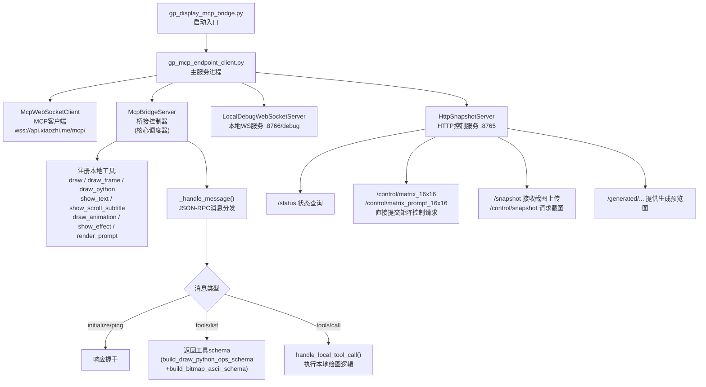
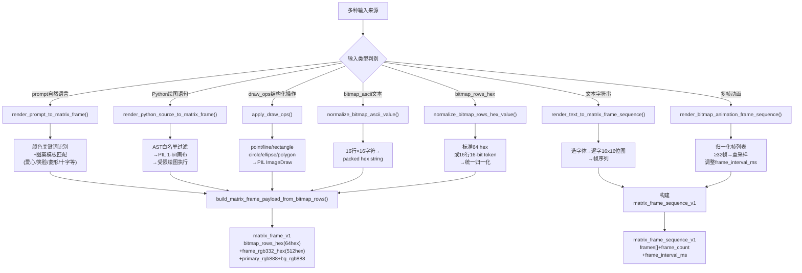
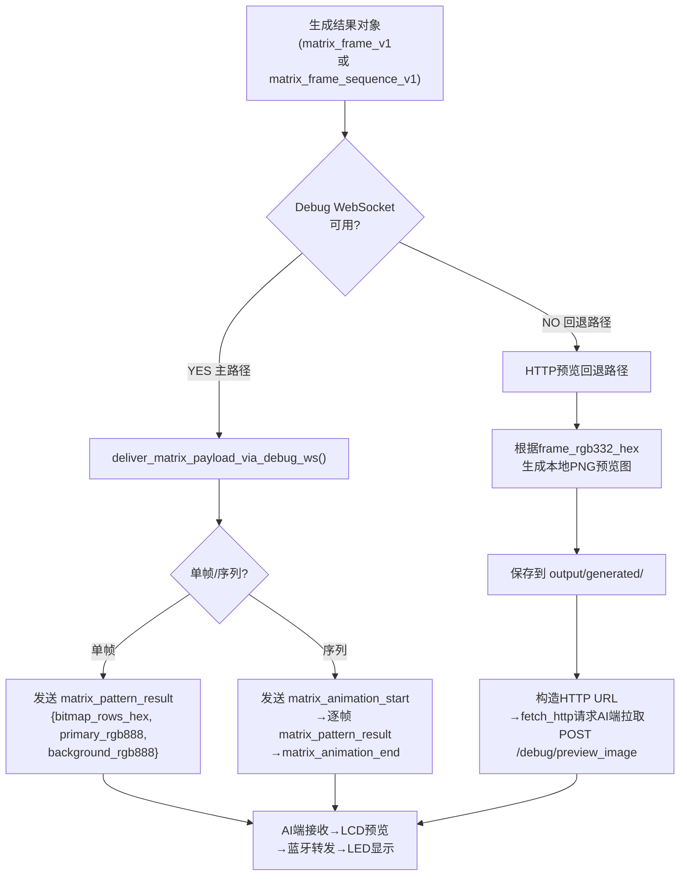
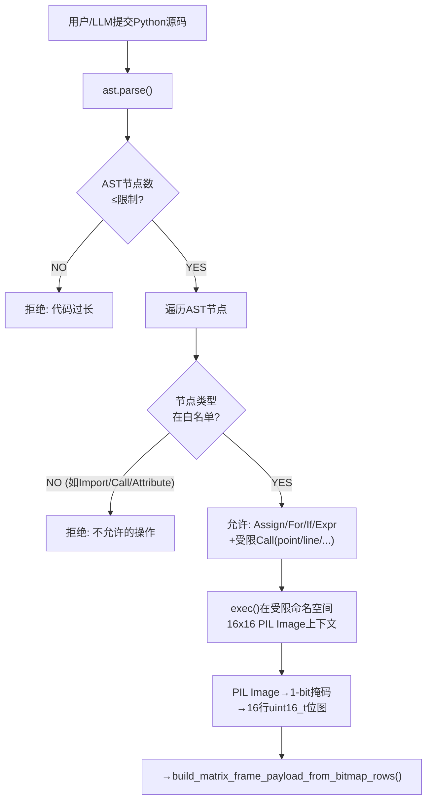
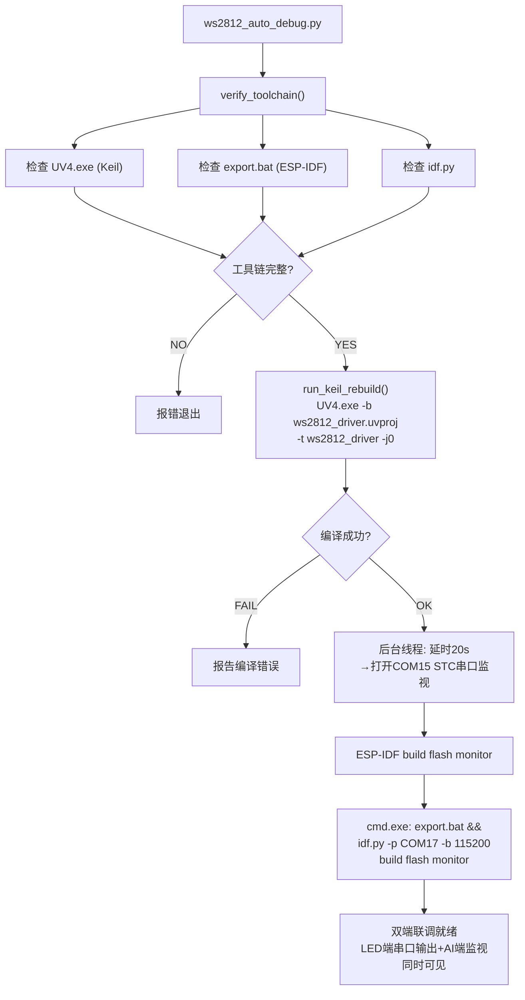

<!-- markdownlint-disable MD004 MD032 -->

# 本地绘图脚本软件结构与实现逻辑

## 1. 文档目的

本文档面向毕业论文撰写，专门说明主机侧本地绘图脚本、MCP 桥接服务和联调工具链的结构与实现逻辑。说明范围集中于 `Project/Script/`，重点回答以下问题：

1. 主机侧如何把自然语言、Python 绘图语句、文本和动画序列转换为统一的矩阵显示结果。
2. MCP 桥接服务如何同时提供 HTTP 控制、Debug WebSocket 和本地状态监控。
3. 为什么主机侧优先输出紧凑位图格式，而不是直接操控底层蓝牙分片。
4. 联调脚本如何把 `LED端` 的 Keil 编译、串口监视和 `AI端` 的 ESP-IDF build/flash/monitor 串成一个自动化流程。

本文档对应仓库中的 `本地绘图脚本` 分类。其核心定位不是替代 `AI端` 和 `LED端` 的实现，而是提供一套对上友好、对下兼容的主机侧中间层。

## 2. 软件总体组成

当前主机侧实现主要由 4 部分组成。

### 2.1 MCP 兼容入口

- 位置：`Project/Script/mcp/gp_matrix/gp_display_mcp_bridge.py`
- 作用：
  - 作为桥接服务启动入口；
  - 将实际运行委托给 `gp_mcp_endpoint_client.py`。

这个文件非常薄，主要目的是简化命令入口和部署使用方式。

### 2.2 桥接服务主体

- 位置：`Project/Script/mcp/gp_matrix/gp_mcp_endpoint_client.py`
- 作用：
  - 连接远端 MCP；
  - 暴露本地 HTTP 控制端点；
  - 管理 Debug WebSocket 服务；
  - 生成、归一化、缓存和转发矩阵绘图结果。

这一部分是主机侧真正的核心控制器。

### 2.3 绘图协议与使用说明

- 位置：`Project/Script/mcp/gp_matrix/gp_matrix_drawing_mcp_usage.md`
- 作用：
  - 规定工具名称、参数格式和动画输入约束；
  - 说明 `bitmap_rows_hex`、`frame_rgb332_hex` 与动画批次的契约边界。

该文档相当于主机侧的“人类可读接口规范”。

### 2.4 联调自动化脚本

- 位置：`Project/Script/tools/ws2812_auto_debug.py`
- 作用：
  - 检查 Keil 和 ESP-IDF 工具链；
  - 执行 `LED端` Keil rebuild；
  - 延迟打开 STC 串口监视；
  - 继续启动 `AI端` 的 build/flash/monitor 流程。

这一部分不参与图像生成，但负责保证跨设备联调时的软件构建与观察链路可重复执行。

## 3. 桥接服务的总体架构

从实现上看，`gp_mcp_endpoint_client.py` 并不是单一脚本，而是一个复合型服务进程。它同时包含以下 4 个角色。

### 3.1 MCP 客户端

`McpWebSocketClient` 负责与远端 MCP 通道建立 WebSocket 连接，并提供：

1. `send_json()`：发送 JSON-RPC 请求；
2. `receive_json()`：接收 JSON-RPC 响应或请求；
3. `respond()`：回应对端的 `initialize`、`ping` 和 `tools/call`。

这使主机脚本既能作为客户端调用远端工具，也能作为本地工具服务端暴露绘图能力。

### 3.2 本地桥接控制器

`McpBridgeServer` 是桥接服务的核心对象。它主要完成如下工作：

1. 注册本地可用工具；
2. 处理远端发来的 `tools/call`；
3. 调度本地绘图函数生成统一结果；
4. 选择通过 Debug WebSocket 直接推送到 `AI端`，或通过 HTTP 预览回退路径请求 `AI端` 拉取图像。

因此，主机侧的真正核心并不是某个具体绘图函数，而是这层“统一调度 + 统一回传”的桥接控制器。

### 3.3 本地 Debug WebSocket 服务

`LocalDebugWebSocketServer` 在主机本地监听一个独立 WebSocket 地址。其作用有两类：

1. 接受 `AI端` 发来的 `hello`、`touch_state_update`、`draw_random_pattern_request` 等调试消息；
2. 把主机生成的 `matrix_pattern_result`、`matrix_animation_start`、`matrix_animation_end` 推送回 `AI端`。

这条链路解决的是“主机主动把结构化绘图结果推给 `AI端`”的问题。

### 3.4 本地 HTTP 服务

`HttpSnapshotServer` 在本地暴露了一组 HTTP 接口，包括：

1. `/status`：查询桥接服务运行状态；
2. `/snapshot`：接收设备侧上传的调试截图；
3. `/control/snapshot`：请求 `AI端` 执行本地截图上传；
4. `/control/matrix_16x16`：直接提交一帧矩阵图像控制请求；
5. `/control/matrix_prompt_16x16`：通过 prompt 生成矩阵图像；
6. `/control/device_preview`：向 `AI端` 的设备预览接口上传图像；
7. `/generated/...`：提供本地生成的预览图片供 `AI端` 拉取。

由此可见，主机侧不仅是“一个绘图脚本”，而是一套同时具备状态查询、控制请求、图像分发和截图接收能力的本地服务。

## 4. 统一数据契约与归一化规则

主机桥接服务的关键价值在于：不论上游来自 prompt、Python 代码、文本、原始位图还是效果命令，最终都要归一化为统一的数据结构。

### 4.1 单帧结果 `matrix_frame_v1`

单帧结果的核心字段包括：

1. `frame_rgb332_hex`：完整 RGB332 帧，长度固定为 `512` 个十六进制字符；
2. `bitmap_rows_hex`：紧凑位图格式，长度固定为 `64` 个十六进制字符；
3. `primary_rgb888` 与 `background_rgb888`；
4. `width = 16`，`height = 16`；
5. `content_type`、`source`、`transcript` 和 `tool_name`。

从设计上看，该结构既能保留最终显示帧，也能保留更紧凑的位图表达，便于后续选择不同下游传输路径。

### 4.2 紧凑位图格式元数据

桥接服务还会生成一段 `compact_frame_format` 元数据，用于明确说明位图语义：

1. `encoding = bitmap_1bit_rgb888_compact_v1`；
2. `row_order = top_to_bottom`；
3. `bit_order = msb_left_to_right`；
4. `row_count = 16`；
5. `bitmap_bytes = 32`；
6. 完整紧凑帧大小 `compact_frame_bytes = 38`。

该元数据的作用是把“这 64 个十六进制字符到底代表什么”解释清楚，避免不同端对位顺序和行顺序理解不一致。

### 4.3 动画序列结果 `matrix_frame_sequence_v1`

文本和动画不会直接返回单帧，而是返回帧序列对象。其核心字段包括：

1. `frames`：帧列表；
2. `frame_count`；
3. `frame_interval_ms`；
4. `content_type`，例如 `text` 或 `animation`；
5. 统一的前景色、背景色与显示尺寸描述。

这意味着主机桥接层从协议设计阶段就把“单帧”和“序列”区分为两类不同输出对象，而不是依赖上游自行约定。

### 4.4 `bitmap_rows_hex` 的容错归一化

`normalize_bitmap_rows_hex_value()` 与相关辅助函数支持两类输入：

1. 标准形式：恰好 `64` 个十六进制字符；
2. 兼容形式：`16` 个按行给出的 `16-bit` 十六进制 token。

脚本会自动把兼容写法重新归一化回标准 `64` hex 输出。这一设计直接降低了 LLM 与人工调试时的输入出错概率。

### 4.5 动画帧数上限与重采样

主机侧规定最大动画帧数为 `32`，与当前 `LED端` 动画缓冲能力保持一致。当输入帧数超过上限时，桥接服务会：

1. 保留首尾关键帧；
2. 进行等间隔重采样；
3. 按比例调整 `frame_interval_ms`，尽量保持总时长近似不变。

这意味着动画约束不是留给 `LED端` 临时拒绝，而是在主机侧预先消化和规范化。

## 5. 绘图工具的实现逻辑

### 5.1 Prompt 模板渲染

`render_prompt_to_matrix_frame()` 面向“自然语言描述”场景。其处理步骤为：

1. 解析 prompt 中的颜色关键词或直接给定的 `#RRGGBB`；
2. 从模板库中选择爱心、笑脸、菱形、十字等预定义 16x16 轮廓；
3. 将模板中的 `#` / `.` 映射为位图行数据；
4. 调用统一单帧构建函数生成 `matrix_frame_v1` 结果。

这种实现把最简单的“根据文本生成图形”问题转化为模板匹配问题，降低了主机侧的计算复杂度。

### 5.2 受限 Python 绘图

`render_python_source_to_matrix_frame()` 面向“给定绘图语句”场景。它使用 Pillow 的 `1-bit` 画布作为中间层，并通过 AST 白名单控制可执行语法：

1. 限制总 AST 节点数；
2. 只允许简单赋值、循环、条件和有限表达式；
3. 只允许调用受控的辅助函数，例如 `point`、`line`、`rectangle`、`circle` 等；
4. 禁止任意导入、系统调用和复杂对象访问。

在执行完成后，脚本会把 1 位掩码图像转换为 16 行位图，再进一步生成统一单帧结果。这种做法兼顾了灵活性和安全性。

### 5.3 文本渲染

`render_text_to_matrix_frame_sequence()` 的目标是把文本转换为逐字帧序列。其主要逻辑为：

1. 逐字选择可用字体并计算字形边界；
2. 将每个字符绘制到 16x16 掩码图像中；
3. 为每个字形生成独立的位图帧；
4. 统一包装为 `matrix_frame_sequence_v1`。

因此，文本播放的本质不是“发送一个字符串”，而是“生成多个离散位图帧组成的时间序列”。

### 5.4 动画序列渲染

`render_bitmap_animation_frame_sequence()` 面向位图动画。其输入可以是：

1. 直接提供的 `bitmap_rows_hex_list`；
2. 结构化 `frames` 数组；
3. 每帧内部再次选择 `bitmap_rows_hex`、`bitmap_rows` 或 `python_source/eval_source` 三种来源之一。

桥接层会先把所有输入帧归一化为标准位图列表，再生成完整动画结果。这种分层设计使上游不必关心最终协议的字段细节。

## 6. 主机结果的投递路径

### 6.1 Debug WebSocket 主路径

当工具结果属于矩阵单帧、文本序列或动画序列时，桥接服务会优先尝试 `deliver_matrix_payload_via_debug_ws()`。其逻辑为：

1. 如果是帧序列，先发送 `matrix_animation_start`；
2. 再逐帧发送 `matrix_pattern_result`；
3. 最后发送 `matrix_animation_end`；
4. 如果是单帧，则直接发送一次 `matrix_pattern_result`。

主机之所以优先走 WebSocket，是因为这条路径可以把结构化矩阵结果直接推送给 `AI端`，减少等待 `AI端` 主动拉取的时延。

### 6.2 HTTP 预览回退路径

若当前结果是普通单帧，且 Debug WebSocket 不可用，则桥接层会进入 HTTP 预览回退逻辑：

1. 根据 `frame_rgb332_hex` 生成一张本地 PNG 预览图；
2. 保存在输出目录下的 `generated` 路径中；
3. 构造可被 `AI端` 访问的 HTTP URL；
4. 调用 `self.screen.preview_image.fetch_http` 请求 `AI端` 主动拉取并显示该预览图。

这种做法的本质是：当“结构化矩阵结果的主动推送”不可用时，退化为“普通图片资源的被动拉取”。

### 6.3 设备预览上传路径

脚本中还实现了针对 `AI端` 本机预览接口的上传函数，例如：

1. `fetch_device_preview_status()` 查询 `AI端` 的 `/debug/preview_status`；
2. `upload_image_to_device_preview()` 和 `upload_bytes_to_device_preview()` 向 `/debug/preview_image` 上传图像；
3. `/control/device_preview` 则把这条能力包装成易于调试的 HTTP 控制入口。

这条路径主要服务于启动阶段和联调阶段，用于确认 `AI端` 的本地 LCD 预览链路已经就绪。

## 7. 联调自动化脚本的实现逻辑

`ws2812_auto_debug.py` 的目标是减少跨设备调试时的重复手工操作。其流程可以概括为以下 4 步。

### 7.1 工具链探测

`verify_toolchain()` 会检查：

1. Keil `UV4.exe` 是否可达；
2. ESP-IDF 的 `export.bat` 是否存在；
3. `idf.py` 是否存在。

这样可以在真正执行构建之前就发现环境问题。

### 7.2 执行 LED 端 Keil 编译

`run_keil_rebuild()` 调用：

```text
UV4.exe -b ws2812_driver.uvproj -t ws2812_driver -j0 -o build_log
```

其作用是只执行 rebuild，不进行下载，保证当前 `LED端` 固件可以先在本地完成编译验证。

### 7.3 延迟启动 STC 串口监视

脚本会在后台线程中等待默认 `20 s`，随后打开 `COM15` 的 STC 串口监视。这样做的原因是：在前期 ESP32 build/flash 阶段不急于占用终端，而在固件真正运行时能够自动捕获 `LED端` 的串口输出。

### 7.4 启动 ESP-IDF build/flash/monitor

最后，脚本通过 `cmd.exe` 组合 `export.bat` 与：

```text
idf.py -p COM17 -b 115200 build flash monitor
```

把 `AI端` 的构建、烧录和监视流程串成一条命令。这样，开发者只需触发一次脚本，就能同时完成两端的构建与观察准备。

## 8. 典型工作流示例

下面以“主机根据 prompt 生成一个 16x16 图案并下发到 `AI端`”为例说明本地脚本的完整逻辑。

### 8.1 接收控制请求

本地 HTTP 接口 `/control/matrix_prompt_16x16` 收到 JSON 请求，例如“绘制一个青色爱心”。

### 8.2 生成统一帧结果

桥接服务调用 `render_prompt_to_matrix_frame()`：

1. 识别出颜色为青色；
2. 匹配模板为爱心；
3. 生成 16 行位图；
4. 组合为包含 `bitmap_rows_hex` 与颜色字段的统一帧对象。

### 8.3 选择投递路径

若 Debug WebSocket 已连接，则桥接服务直接把 `matrix_pattern_result` 推送给 `AI端`；若未连接，则生成 PNG 预览图并调用 HTTP 预览回退路径。

### 8.4 AI 端预览与下游转发

`AI端` 接收到结果后，一方面在本地 LCD 上显示预览，另一方面把结果转发为 layered 单帧或动画事务，由 `LED端` 完成最终显示。对于 `show_effect` 这类原生效果工具，主机侧还可以直接返回 `matrix_action_result`，让 `AI端` 复用 `SetAction` 命令而不必重新逐帧绘制。

由此可以看出，主机脚本真正解决的问题不是“替代蓝牙驱动”，而是“把多种人类友好输入统一转换为下游可执行的数据对象”。

## 9. 核心实现流程图

以下流程图以 Mermaid 格式描述本地绘图脚本各关键环节的实现逻辑。

### 9.1 桥接服务总体架构



### 9.2 输入归一化管道



### 9.3 结果投递双路径



### 9.4 受限 Python 绘图安全模型



### 9.5 联调自动化流程



## 10. 本章小结

从软件结构上看，本地绘图脚本部分具有以下特点：

1. 它将 prompt、Python 绘图、文本和动画统一映射到同一套矩阵数据契约；
2. 它通过 Debug WebSocket 与 HTTP 双路径，将结果稳定送达 `AI端`；
3. 它通过 AST 白名单、位图归一化和动画重采样，提高了系统对 LLM 输出和人工输入的容错能力；
4. 它通过联调自动化脚本，把双端构建、烧录、监视整合为可重复执行的流程。

因此，本地脚本部分并不是外围辅助工具，而是连接主机侧生成逻辑与嵌入式显示链路的重要桥接层。
